# Project Manager Framework

LLM 코딩 에이전트의 작업을 대화가 아니라 repo 안의 `board/wiki/log/ADR/domain`에 영속화해,
Claude Code·opencode·codex가 같은 프로젝트를 안전하게 이어받고 병렬로 진행하게 하는
harness-neutral PM 운영 프레임워크다.

LLM 으로 하루짜리 수정은 쉽게 끝난다. 문제는 며칠짜리 프로젝트다. 세션이 compaction 되고,
어제의 결정이 사라지고, 여러 에이전트가 같은 파일을 고치며, 만든 주체가 스스로 검토한다.
이 프레임워크는 그 문제를 더 긴 프롬프트가 아니라 파일로 남는 운영 구조로 푼다.

실전 멀티-에이전트 프로젝트에서 260개 이상의 ticket 과 70개 이상의 ADR 을 거치며 다듬은
운영 방식을 도메인 무관 템플릿으로 추출했다.

이 문서는 사람을 위한 개요다. 에이전트의 진입점은 [`CLAUDE.md`](CLAUDE.md)(Claude Code) 와
`AGENTS.md`(opencode·codex) 이고, 세부 절차는 [`docs/`](docs/) 와 각 타깃 README 에 있다.

---

## 해결하는 문제

며칠짜리 LLM 프로젝트에서 실제로 깨지는 지점은 대체로 비슷하다.

- **컨텍스트 압축(compaction)**: 대화가 길어지면 하니스가 요약본으로 세션을 이어 붙인다.
  이때 절차, 금지 사항, 미묘한 결정 근거가 조용히 사라진다.
- **병렬 작업 충돌**: 여러 에이전트가 같은 트리를 동시에 고치면 누가 무엇을 잡았는지 흐려진다.
- **검토 부재**: 만든 세션이 스스로 통과 판정을 내리면 놓치는 결함이 많다.
- **하니스별 실제 장애**: opencode 는 큰 응답과 큰 write 에서 조용히 잘리거나 실패할 수 있고,
  스타트업 fetch stall 로 멈출 수 있다. Claude Code 도 컨텍스트 임계와 권한/훅 표면을 따로
  다뤄야 한다.
- **하니스 단일 의존**: 한 하네스에 모든 PM·구현·검토를 묶으면 그 하네스의 토큰 한도,
  출력 상한, 도구 권한, 장애 패턴에 프로젝트 운영 전체가 같이 묶인다.
- **운영 지식 유실**: "왜 이렇게 했는지"가 대화 안에만 있으면 다음 세션은 같은 결정을 다시
  한다.

이 프레임워크는 이런 문제를 "더 좋은 프롬프트"로 풀지 않는다. 상태와 절차를 세션 밖 파일로
빼고, 에이전트가 매번 같은 운영 레일을 밟게 한다. 그래서 발표의 핵심 질문은 "어떤 agent 가
제일 똑똑한가"가 아니라 "agent 가 바뀌고 세션이 끊겨도 일이 어디에 남는가"다.

| 문제 | 프레임워크의 대응 |
|---|---|
| 세션이 길어져 compaction 당함 | 컨텍스트 임계 전에 `/pm-handoff` 로 끊고, 다음 세션은 log 와 pm_state 로 복원 |
| 할 일이 대화 속에 흩어짐 | ticket 보드가 할 일과 소유자를 저장 |
| 지식이 요약에서 사라짐 | architecture, domain, ADR, status 문서가 프로젝트 지식을 저장 |
| 만든 주체가 스스로 검토함 | developer 와 code-reviewer 를 분리 |
| opencode 대용량 응답/write 가 조용히 깨짐 | cap-hit 감지, safe_write, 파일-전달 규약, stall watchdog 을 어댑터에 포함 |
| 한 하네스에 과의존함 | Claude Code, opencode, codex 가 같은 board/wiki 를 공유해 역할별로 교차 사용 |
| 여러 세션이 같은 작업을 잡음 | claim, worktree slot, task identity 로 소유를 명시 |

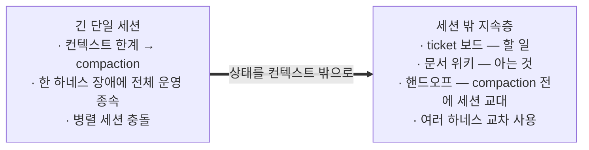

---

## 무엇이 다른가

많은 도구는 agent 를 더 잘 실행하는 데 집중한다. 이 프레임워크는 실행 도구가 아니라, 여러
하네스가 같이 읽고 이어받을 수 있는 프로젝트 운영층을 repo 안에 둔다.

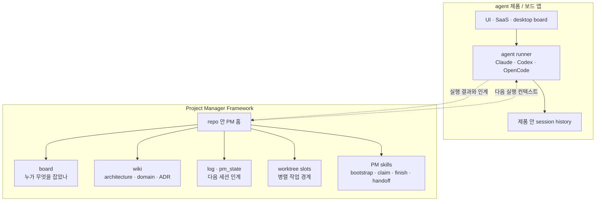

| 보통의 agent 실행 도구 | 이 프레임워크 |
|---|---|
| 특정 제품이나 하네스의 session 이 중심 | repo 안의 PM 홈이 중심 |
| 작업 흐름이 UI/대화 기록에 남음 | board/wiki/log/ADR/domain 파일에 남음 |
| agent 를 실행하고 결과를 받음 | PM 이 ticket 을 쪼개고, 역할을 위임하고, 검토와 핸드오프를 남김 |
| 한 도구의 장애·토큰·권한 모델에 묶이기 쉬움 | Claude Code, opencode, codex 가 같은 상태를 공유해 교차 사용 |
| 병렬 실행은 가능해도 소유·인계 규칙은 별도 설계 필요 | claim, task, slot, readonly slot, handoff 가 기본 운영 규칙 |

즉, agent 를 대체하는 도구가 아니라 agent 들이 오래 일할 수 있게 만드는 작업장이다. 다음 장의
구성 요소들은 모두 이 작업장을 만들기 위한 부품이다.

---

## 구성

repo 안 PM 홈은 네 가지 부품으로 구성된다. board 는 일을 나누고, wiki 는 지식을 남기고, 역할
분리는 생성과 검토를 갈라 놓고, 스킬은 반복 절차를 기계가 실행하게 한다.

| 구성 요소 | 무엇 | 핵심 파일 |
|---|---|---|
| Ticket 보드 | 여러 LLM 세션이 충돌 없이 병렬 작업하는 가벼운 작업 보드. 디렉토리가 상태고 `mv` 가 atomic lock 이다. | `.project_manager/tools/board.py` |
| 문서 위키 | architecture.md(현재 아키텍처의 단일 진실), domain 지식 레이어(코드에 연결된 살아있는 페이지), decisions(ADR), 상태·일지. `[[wikilink]]` 와 frontmatter 로 엮인다. | `.project_manager/wiki/` |
| 역할 분리 | PM 세션이 ticket 을 발행하고 researcher(조사), architect(설계), developer(구현), code-reviewer(검토) 네 축에 위임한다. 만든 주체가 검토하지 않고, 결정과 종합은 PM 이 한다. | 어댑터층(`.claude/agents/` 등), `pm_role.md` |
| PM 스킬 | 부트스트랩, claim, 위임, finish, 핸드오프 같은 반복 워크플로를 단계 단위로 강제한다. | `.project_manager/tools/pm_*.py`, 어댑터층 |

네 구성 요소 모두 도메인 내용을 모르기 때문에 어느 프로젝트에나 이식된다. 프로젝트에 넣으면
사용자는 새 앱을 배우기보다, 평소 쓰는 하네스에서 몇 개의 PM 명령을 호출하는 방식으로 시작한다.

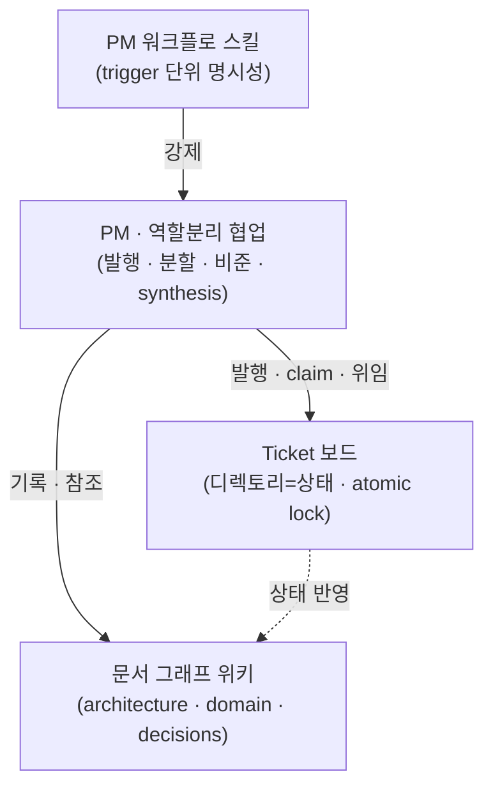

---

## 빠른 시작

설치 후 사용감은 단순해야 한다. 프로젝트에 프레임워크를 넣고, 원하는 하네스로 세션을 연 뒤,
`/pm-bootstrap` 으로 현재 상태를 읽고 자연어로 일을 시킨다.

### 1. 프로젝트에 프레임워크 넣기

프레임워크 checkout 루트(`<manager>`)에서 실행한다. 처음이면 여러 하네스를 함께 넣어도 된다.
Claude Code, opencode, codex 어댑터는 같은 엔진과 같은 board/wiki 를 공유한다.

```bash
<manager>/pm-import.sh --new <my-project> --harness claude
<manager>/pm-import.sh --new <my-project> --harness opencode
<manager>/pm-import.sh --new <my-project> --harness codex
```

에이전트에게 채택 자체를 맡기려면 [`ADOPT.md`](ADOPT.md), 손으로 밟으려면
[`docs/manual-import.md`](docs/manual-import.md), 기존 프로젝트에 얹으려면 `--into`.

### 2. 세션 열고 부트스트랩하기

새 프로젝트 폴더에서 `claude`, `opencode`, `codex` 중 원하는 하네스를 실행한 뒤:

```text
/pm-bootstrap
```

그러면 PM 세션이 board, git, 최근 log, 남은 작업을 읽고 다음 선택지를 제안한다.
사람이 `board.py` 플래그를 외울 필요는 없다. 반복 절차는 스킬이 감싼다.

### 3. 자연어로 일 시키기

예를 들어:

```text
결제 취소가 두 번 청구되는 버그를 티켓으로 만들어줘.
```

```text
그 티켓 developer 에게 위임하고, 끝나면 reviewer 로 검토까지 돌려줘.
```

```text
세션 마무리하자. 핸드오프 남겨줘.
```

PM 은 ticket 을 발행하고, 필요하면 설계 spike 나 ADR 로 결정을 남기고, 구현과 검토를 분리해서
진행한다. 세션을 마칠 때는 `/pm-handoff` 로 다음 세션이 이어받을 기록을 남긴다. 이 한 번의
사용감 뒤에는 아래 라이프사이클이 반복된다.

---

## 세션 라이프사이클

한 PM 세션은 부트스트랩으로 시작한다. 그 뒤에는 ticket 을 하나 처리하고 바로 끝날 수도 있고,
남은 컨텍스트가 충분하면 다음 ticket 으로 이어 갈 수도 있다. 세션을 넘겨야 할 때만 핸드오프를
남긴다.

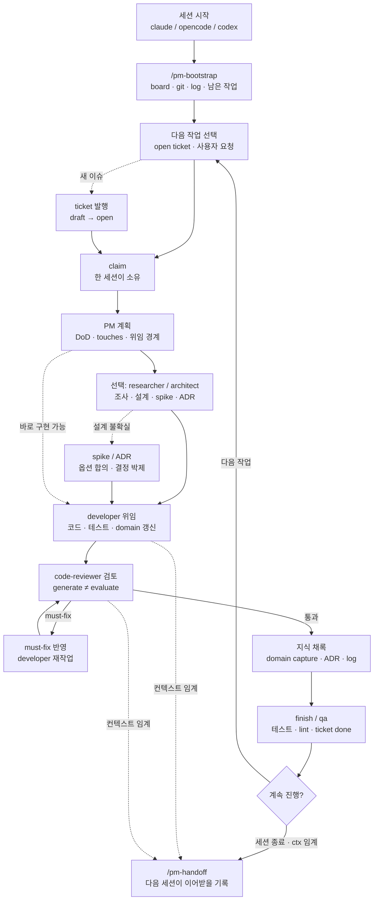

실제 대화는 이렇게 흐른다:

```text
/pm-bootstrap
```

```text
T-0123 잡고 developer 에게 구현 위임해줘. 끝나면 reviewer 로 검토까지.
```

```text
이번에 알게 된 결제 취소 흐름은 domain 에 채록해줘.
```

```text
마무리하자. qa 확인하고 handoff 남겨줘.
```

세션 안에서 자주 갈라지는 작업은 네 종류다.

| 상황 | 보통 하는 일 | 남는 기록 |
|---|---|---|
| 바로 구현 가능한 일 | ticket claim → developer → reviewer → finish | ticket done, log |
| 사실 확인이 필요한 일 | researcher 로 읽기 조사 → PM 이 종합 | log, domain research |
| 설계 결정이 필요한 일 | spike 로 옵션 합의 → ADR 발행 → 구현 ticket 분할 | spike, ADR, ticket |
| 작업 중 배운 지식 | 관련 `covers:` domain 페이지 갱신 | domain page, stale 해소 |

---

## 작업을 영속시키는 방식

이 프레임워크의 핵심 가치는 "긴 대화를 오래 붙잡는 것"이 아니라, 어느 세션이 끝나도 다음
세션이 같은 작업을 이어받을 수 있게 만드는 것이다. PM 세션은 진행 중인 판단을 대화 안에만
두지 않고, board, wiki, log, per-slot state 에 나눠 남긴다. 다음 세션은 `/pm-bootstrap` 으로
그 파일들을 다시 읽고 현재 작업 상태를 복원한다.

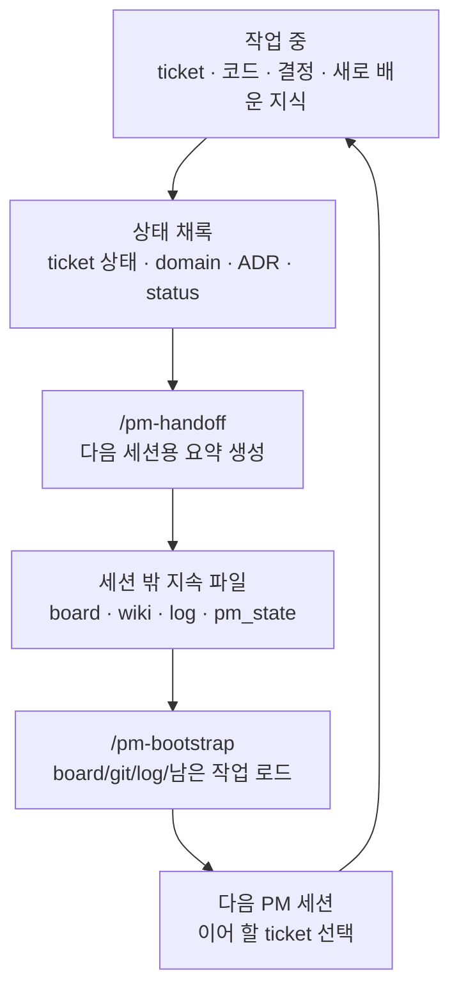

핸드오프에는 다음 세션이 판단을 복원하는 데 필요한 내용만 남긴다.

| 남기는 것 | 이유 |
|---|---|
| 이번 세션의 산출물 | 무엇이 실제로 바뀌었는지 빠르게 파악 |
| 완료·진행·막힌 ticket | 다음에 잡을 일과 건드리면 안 되는 일을 구분 |
| 남은 작업과 권장 다음 액션 | 다음 세션 첫 선택 비용을 줄임 |
| 결정 근거와 사용자 판단 | 같은 논쟁을 반복하지 않음 |
| 회귀, lint, git 상태 | 이어받는 시점의 신뢰도를 확인 |
| domain/ADR/status 갱신 포인트 | 코드 이해와 운영 지식이 문서에 남았는지 확인 |

부트스트랩은 그 반대편이다. 새 세션은 기억으로 시작하지 않고, 기계가 모은 현재 상태로 시작한다.

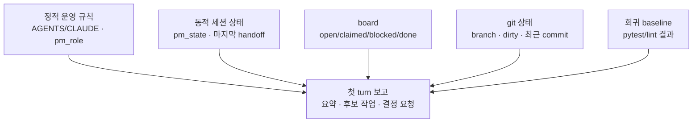

이 절차는 사람이 매번 체크리스트를 외워서 하는 일이 아니다. 스킬은 사람이 호출하는 짧은 진입점이고,
기계는 반복 실측과 부기를 맡는다.

| 스킬/명령 | 자동화하는 일 |
|---|---|
| `/pm-bootstrap` | board, git, 마지막 log, 남은 작업, 회귀 상태를 한 화면에 모아 첫 turn 보고 생성 |
| `/pm-wave-claim` | ticket 본문과 의존성을 검사한 뒤 현재 task/slot 명의로 claim |
| `/pm-dev-delegate` | developer/researcher/architect/reviewer 에게 넘길 컨텍스트와 DoD 를 표준화 |
| `/pm-wave-finish` | 테스트, ticket 완료 부기, status/log 갱신 후보, git stage 를 한 흐름으로 묶음 |
| `/pm-handoff` | log entry skeleton, pm_state sliding window, 다음 세션 인계 프롬프트, 회귀/git 상태 생성 |

그래서 작업의 단위는 "한 대화"가 아니라 "파일에 남은 ticket 과 인계 상태"가 된다. Claude Code,
opencode, codex 중 어느 하네스로 다음 세션을 열어도 같은 board/wiki/log 를 읽기 때문에 이어받는
기준이 같다.

---

## 작업 흐름

한 wave 에서 PM 은 researcher, architect, developer, code-reviewer 네 축에 일을 나눠 주고
결과를 종합한다. 발표에서는 한 그림에 모두 넣기보다 유즈케이스별로 보면 이해하기 쉽다.

**조사만 필요한 경우**

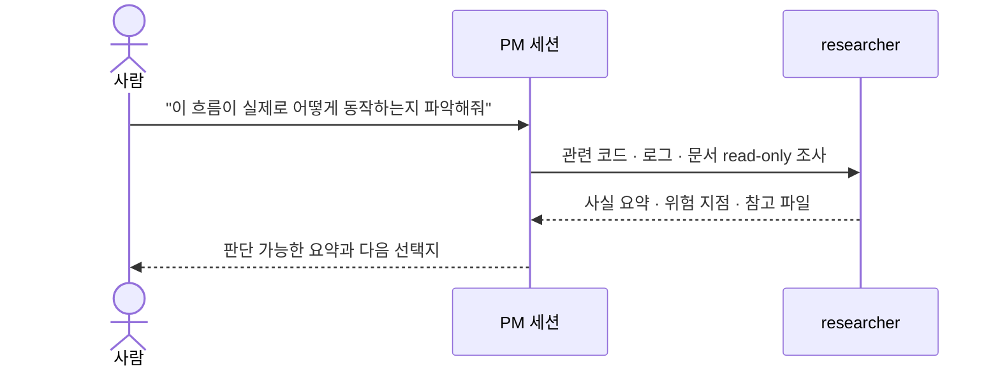

**설계 결정이 필요한 경우**

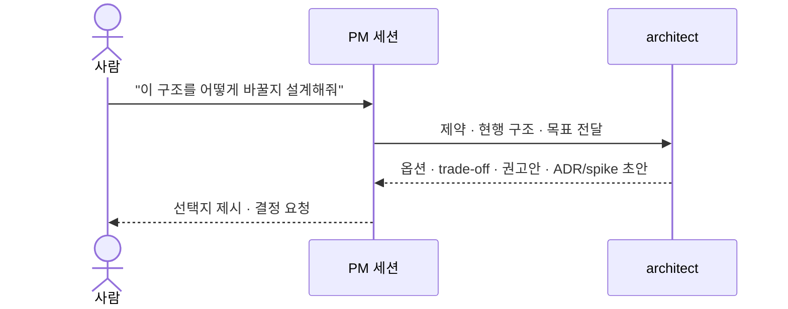

**구현과 검토가 필요한 경우**

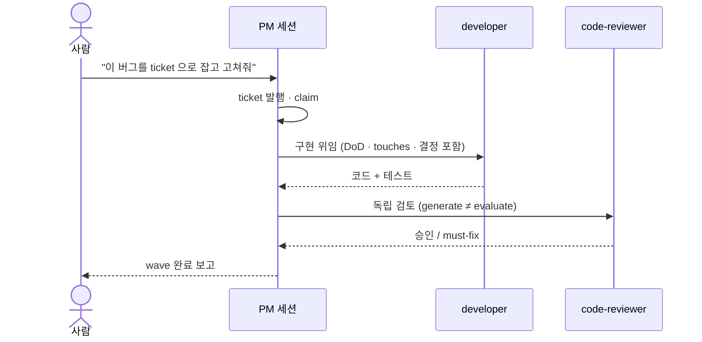

**작업 중 배운 것을 남기는 경우**

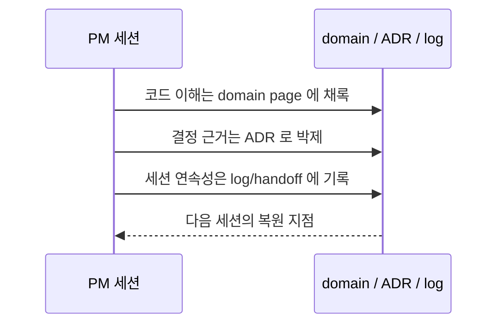

---

## Task 와 Slot

여기까지가 한 세션의 기본 흐름이다. 여러 세션이나 여러 repo 를 동시에 굴릴 때는 task 와 slot 으로
작업 흐름과 실제 코드 작업공간을 분리한다.

여러 repo 를 하나의 PM 홈(공유 보드와 위키)에 묶어 여러 세션이 같이 쓸 수 있다. N 세션 ×
M repo 구성이고, 혼자 한 repo 만 쓰면 오버헤드 없이 solo 로 동작한다. 셋업과 조회는 루트의
`pm-config.sh` 하나로 하고, 각 프로젝트는 worktree 슬롯으로 붙인다. 상세는
[`docs/multi-repo.md`](docs/multi-repo.md).

이때 용어가 둘 있다.

- **slot**: 실제 코드 작업공간이다. `work/<repo>_<N>` 형태의 git worktree 로 만들어지고,
  한 세션이나 task 가 빌려 쓴다.
- **task**: 사람이 붙이는 작업 흐름 이름이다. `doc`, `release`, `main` 처럼 부를 수 있고,
  slot 과 독립적이다. task 는 필요할 때 slot 을 빌리고, 끝나면 반납한다.

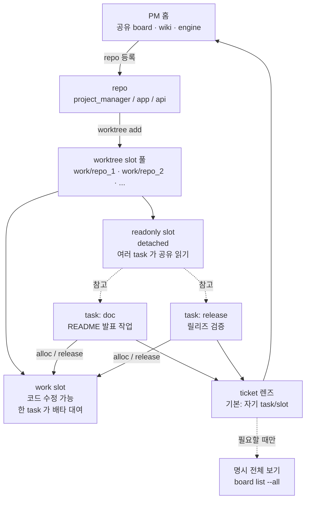

처음에는 slot 을 만든다. 이건 코드 checkout 을 새로 만드는 물리 작업이라 사용자가 명시적으로
한다:

```bash
./pm-config.sh worktree add <repo>
```

이후 task 가 idle slot 을 빌린다. 자동으로 새 slot 을 만들지는 않는다. 풀에 남는 slot 이 없으면
생성 요청으로 멈춘다:

```bash
./pm-config.sh alloc <repo> --task doc
./pm-config.sh status
```

작업이 끝나면 같은 task 명의로 반납한다:

```bash
./pm-config.sh release work/<repo>_<N> --task doc
```

task 전체를 닫을 때는 claimed ticket 이 남아 있지 않고, 보유 slot 이 clean 이어야 한다:

```bash
./pm-config.sh task end doc
```

task 에 ticket prefix 를 줄 수도 있다. prefix 는 분류 라벨이지 접근 권한 경계가 아니다:

```bash
./pm-config.sh task prefix doc docs
./pm-config.sh task prefix doc none
```

slot 에 직접 바인딩해 일하는 방식도 있다. 세션이 부트스트랩할 때 repo 와 슬롯을 지정해
"나는 이 repo 의 N 번 PM" 이라고 선언한다. 이후 그 세션의 작업 위치와 보드 조작 귀속이 그
슬롯으로 잡힌다:

```text
/pm-bootstrap repo-a --slot 2
```

코드를 읽기만 할 기준면이 필요하면 readonly slot 을 만든다. readonly slot 은 detached HEAD 이고,
배타 대여 대상이 아니다. research, release livegate 기준면, 외부 리뷰 경로 핀처럼 "읽는 슬롯"으로
쓴다:

```bash
./pm-config.sh worktree add <repo> --readonly
```

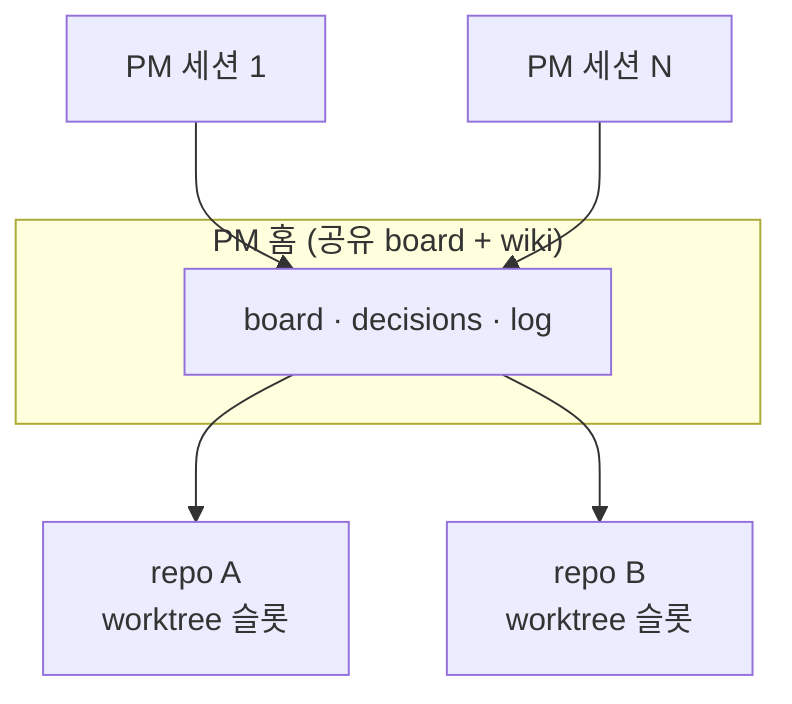

---

## 다른 사람·다른 세션과 작업할 때

공유 보드와 위키를 쓰면 여러 세션이 같은 프로젝트를 동시에 볼 수 있다. 안전하게 굴리는 기준은
간단하다.

먼저 경계를 나눈다. 내 slot 과 task lease 는 내 작업 실행 경계이고, board/wiki 는 공유 지식
경계다. 다른 사람의 ticket 과 slot 은 기본 렌즈에 섞이지 않고, 전체 상황을 볼 때만 명시적으로
넓힌다.

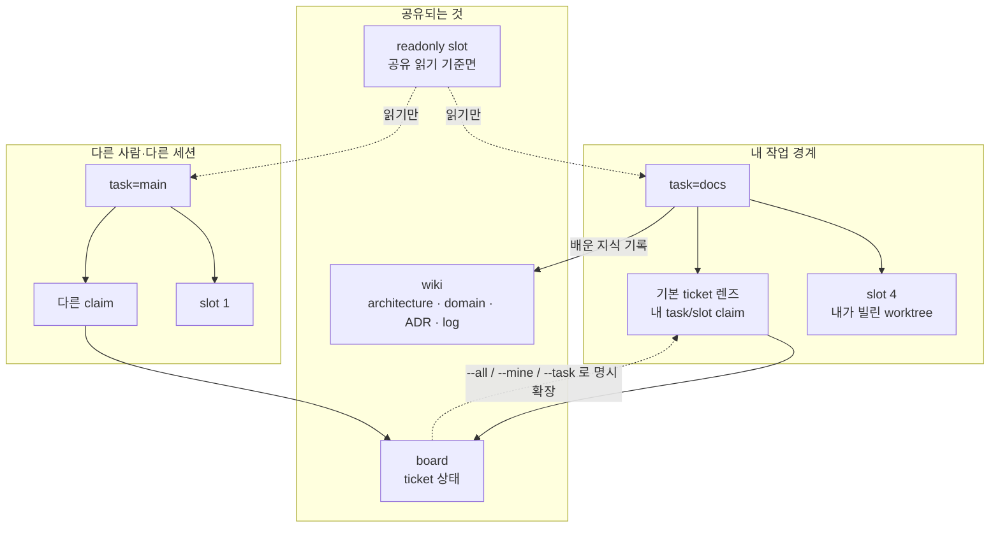

- 각 task/slot 은 기본 화면에서 자기 흐름의 ticket 만 본다. 다른 세션의 backlog 를 항상 섞어
  보여주지 않는다.
- 내 slot 에만 해당하는 것은 checkout, dirty state, branch/base, task lease 다. 이 값들은 다른
  세션의 slot 과 공유되지 않는다.
- 공유되는 것은 board 의 ticket 상태와 wiki 의 지식이다. 단, 기본 조회는 현재 사용자와 현재
  task/slot 기준으로 좁혀서 보여준다.
- 전체 상황이 필요하면 명시적으로 전체 보기를 한다. 예: `board.py list --all`.
- 한 사용자의 전 task/slot 흐름을 보고 싶으면 user-wide 렌즈를 쓴다. 예: `board.py list --mine`.
- 특정 task 만 보려면 task 렌즈를 쓴다. 예: `board.py list --task doc`.
- slot 세션은 repo/slot 정체성을 명시한다. 예: `board.py list --repo repo-a --slot 2`.
- 다른 사용자의 ticket 은 자기 렌즈에 섞이지 않는다. 여러 사용자가 같은 board 를 공유해도,
  기본 조회는 현재 사용자와 현재 task/slot 정체성을 기준으로 좁혀진다.
- 남이 claim 한 ticket 은 건드리지 않는다. 새 일이면 새 ticket 을 만들거나 open ticket 을 claim 한다.
- 공유 지식은 대화가 아니라 wiki 에 남긴다. 코드 이해는 domain 페이지, 결정 근거는 ADR, 세션
  연속성은 log/handoff 에 둔다.
- 코드 읽기 기준면은 readonly slot 을 쓴다. readonly slot 은 배타 대여하지 않으므로 여러 세션이
  같이 참고해도 된다.
- 보드 숫자는 스냅샷일 수 있다. 부트스트랩이나 list 출력이 offline freshness 경고를 내면 최신
  원격 상태를 단정하지 않는다.
- 사용자나 다른 PM 과 맞춰야 하는 일은 ticket/ADR/log 에 남겨 다음 세션이 같은 기준을 보게 한다.

---

## 하네스와 엔진 갱신

하네스는 LLM 실행 환경 어댑터다. Claude Code, opencode, codex 를 같은 PM 홈에 붙일 수 있고,
셋 모두 같은 엔진(`.project_manager/`)과 같은 board/wiki 를 공유한다. 그래서 한 프로젝트에서
하네스를 섞어 쓸 수 있다.

이게 중요한 이유는 하네스마다 강점과 실패 모드가 다르기 때문이다. PM 대화는 Claude Code 로
열고, 대용량 산출은 opencode 의 파일-전달 규약과 safe_write 를 쓰고, codex 는 별도 실행 하네스나
외부 검토 게이트로 돌릴 수 있다. 어느 하나가 토큰 한도나 도구 문제에 걸려도 ticket, log, ADR,
domain 지식은 같은 PM 홈에 남아 다른 하네스가 이어받는다.

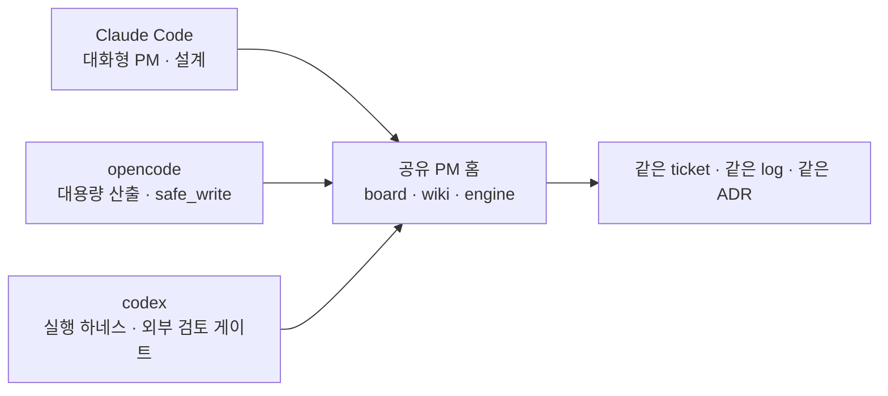

새 프로젝트를 만들 때 하나만 고르거나 여러 하네스를 넣을 수 있다:

```bash
./pm-import.sh --new <project> --harness claude
./pm-import.sh --new <project> --harness opencode
./pm-import.sh --new <project> --harness codex
```

이미 도입된 프로젝트에 두 번째 하네스를 붙일 때는 `add-harness` 를 쓴다. 기존 파일을 덮어쓰기 전에
계획을 볼 수 있다:

```bash
./pm-config.sh add-harness opencode --dry-run
./pm-config.sh add-harness opencode
./pm-config.sh add-harness codex --dry-run
./pm-config.sh add-harness codex
```

엔진 갱신은 채택자 루트에서 받는다:

```bash
./pm-update.sh --dry-run
./pm-update.sh
```

`pm-update` 는 manifest 에 등록된 엔진 파일과 host 하네스 어댑터만 갱신한다. 프로젝트의 board,
wiki, ticket, log 같은 인스턴스 상태는 덮어쓰지 않는다. 나중에 붙인 guest 하네스는 host manifest
범위 밖이므로, 그 어댑터 갱신은 `add-harness <harness>` 를 다시 실행해 받는다.

엔진 버전 관리는 별도 `engine.version` 파일이 아니라 git 으로 한다. 릴리즈는 git tag 와
CHANGELOG 로 식별하고, 채택자는 `local.conf` 의 upstream rev baseline 으로 "어디까지 받았는지"를
추적한다. 그래서 갱신 전에는 `pm-update --dry-run` 으로 받을 변경을 보고, 갱신 후에는 test/lint 로
현재 프로젝트에서 실제 동작을 확인한다.

## 티켓의 수명

티켓은 디렉토리 사이를 이동하며 상태가 바뀐다. 디렉토리가 곧 상태라서 별도 DB 없이 `mv` 가
atomic lock 역할을 한다.

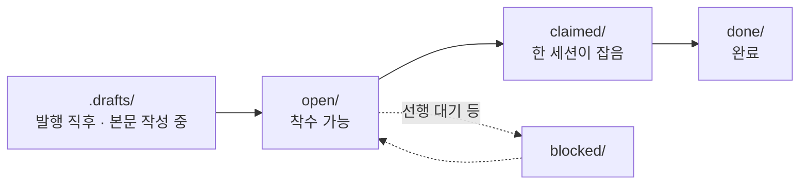

- **발행** — 티켓은 draft 로 시작한다. 목표와 완료 조건이 채워지기 전에는 공유 보드에
  올라가지 않고, 본문을 채워 promote 해야 open 이 된다.
- **claim** — 세션이 티켓을 잡으면 그 세션 명의로 귀속된다. 이미 잡힌 티켓은 다른 세션이
  잡을 수 없다 (병렬 충돌 방지). `depends_on` 으로 선후를 걸어 두면 선행이 끝나기 전에는
  잡지 않는다.
- **완료** — 구현과 검토가 끝나면 done 으로 옮긴다. 테스트 통과가 완료 조건이고, 완료
  시각과 세션이 티켓에 남아 나중에 "언제 누가 무엇을 했나"를 board 에서 되짚을 수 있다.

할 일이 생기면 티켓으로 등록한다:

```text
결제 취소가 두 번 청구되는 버그를 티켓으로 만들어줘.
```

구현과 검토를 맡긴다. 만든 쪽과 검토하는 쪽은 자동으로 분리된다:

```text
그 티켓 dev 에게 위임해서 구현하고, 끝나면 리뷰어로 검토까지 돌려줘.
```

열린 티켓이 쌓여 있으면 한꺼번에 처리시킨다:

```text
wave 진행해줘 — 열린 티켓 최대한 많이.
```

---

## Spike 와 ADR

굳혀야 할 설계 결정은 두 단계로 남긴다.

**Spike** 는 설계 과정의 기록이다. 세션이 혼자 결정하지 않고, 실측한 현황과 옵션을 사용자와
한 절씩 합의하며 문서로 다듬는다. 합의가 끝나면 봉인해서(sealed) 불변 기록이 되고, 이후
개정은 새 파일로 쌓인다.

**ADR**(Architecture Decision Record) 은 spike 에서 굳힌 결정의 요약이다. 무엇을 왜 그렇게
정했고 어떤 대안을 기각했는지가 번호로 남는다. 현재 구조의 단일 진실은 architecture.md 가
갖고, ADR 은 "왜 이렇게 만들었나"의 역사를 맡는다. 시간이 지나 맥락을 잃은 세션도 결정의
근거를 문서에서 복원할 수 있다 — compaction 으로 잃기 쉬운 것이 바로 이 결정의 맥락이다.

진행은 대화다. 주제를 열면:

```text
멀티 세션 정체성 문제를 설계 spike 로 다뤄줘.
```

세션이 코드와 데이터를 실측해 현황을 보고하고 scope 를 확정한 뒤, 옵션 A/B 를 장단점과
권고와 함께 제시한다. 사람은 한 절씩 결정해 간다:

```text
A안으로 가자. 훅은 권고안대로.
```

모든 절이 합의되면 사인오프로 봉인(sealed)하고, 굳힌 결정을 ADR 과 구현 티켓으로 발행시킨다:

```text
사인오프. ADR 발행하고 구현 티켓으로 쪼개서 진행해줘.
```

---

## Domain 지식

작업하며 알게 된 도메인 지식은 위키의 domain 페이지로 쌓는다. 페이지는 `covers:` 로 코드
글롭에 연결돼 있어서, 그 코드를 고치면 관련 페이지가 소환되고, 코드가 페이지보다 새로워지면
stale 표시가 붙는다. 배운 것은 `domain capture` 로 페이지에 적는다. 지식이 정적 문서로
죽지 않고 코드를 따라 산다.

```text
이번에 파악한 결제 취소 흐름을 domain 페이지로 채록해줘.
```

---

## 에이전트 구성

PM 이 메인 세션이고, 일은 네 축의 서브에이전트에 나눠 준다. 만든 주체가 검토하지 않는다는
분리가 핵심이다.

| 에이전트 | 하는 일 | 하지 않는 일 |
|---|---|---|
| PM (메인 세션) | ticket 발행·분할·위임·비준, 보드와 일지 부기. 결정과 종합은 여기서만 한다. | 직접 구현 (위임이 원칙) |
| researcher | 여러 파일과 레퍼런스를 훑어 사실만 수집해 온다 (read-only). | 코드·문서 수정 |
| architect | 설계 노동 — 옵션 분석, ADR/스펙 초안, 인터페이스 설계. | 결정·발행 (비준은 PM) |
| developer | 티켓 하나를 코드와 테스트로 구현한다. | 보드 조작, 일지 갱신 |
| code-reviewer | developer 의 변경을 독립 검토하고 승인/must-fix 를 낸다. | 코드 수정 |

모델과 권한은 어댑터 정의에서 정한다. Claude Code 는 `.claude/agents/<역할>.md`,
opencode 는 `.opencode/agents/<역할>.md`, codex 는 `.codex/agents/<역할>.toml` 쪽 정의를 쓴다.
역할별 모델이나 권한을 바꾸고 싶으면 해당 하네스 어댑터만 조정하면 된다.

보드와 엔진이 하니스 중립이라 하네스를 섞어 쓸 수 있다. 예를 들어 PM 세션은 Claude Code 로
열고, 대용량 산출은 opencode 로 처리하고, codex 로 별도 검토를 돌려도 같은 ticket 보드와
같은 log 를 공유한다.

---

## 디렉토리 구조

엔진(`.project_manager/`)은 모든 타깃이 공유하고, 어댑터층만 하니스마다 다르다:

```
<프로젝트 루트>/
├── (진입 문서)                 # claude_code: CLAUDE.md · opencode/codex: AGENTS.md
├── .project_manager/           # 공유 엔진 (숨김 — ls -a)
│   ├── tools/                  #   board.py · domain.py · ticket_finish.py · pm_*.py
│   └── wiki/                   # 문서 위키
│       ├── architecture.md     #   현재 아키텍처의 단일 진실
│       ├── status.md           #   활성 모듈 매트릭스
│       ├── domain/             #   살아있는 지식 레이어 (covers 로 코드 추적)
│       ├── decisions/          #   ADR — 결정과 근거
│       ├── pm_role.md · pm_state.md · pm_playbook.md   # PM 운영 매뉴얼과 인계 상태
│       ├── log/                #   작업 일지 — current.md + archive/
│       ├── tickets/            #   open/ claimed/ blocked/ done/ + _template
│       └── specs/ · ideas/ · raw/                       # 사양 · 아이디어 · 스냅샷
└── (어댑터층)                  # claude_code: .claude/ · opencode: .opencode/ · codex: .codex/ + 진입 문서
```

어댑터층은 그 하니스의 에이전트와 skill 정의, 진입 문서다. 세부는
[`templates/claude_code/README.md`](templates/claude_code/README.md),
[`templates/opencode/README.md`](templates/opencode/README.md),
[`templates/codex/README.md`](templates/codex/README.md) 를 본다.

---

## 문서

| 필요한 것 | 위치 |
|---|---|
| 수동 도입 절차 | [`docs/manual-import.md`](docs/manual-import.md) |
| placeholder 채우기 | [`docs/placeholders.md`](docs/placeholders.md) |
| 이식성 등급 | [`docs/portability.md`](docs/portability.md) |
| multi-repo 운용 | [`docs/multi-repo.md`](docs/multi-repo.md) |
| 에이전트용 채택 가이드 | [`ADOPT.md`](ADOPT.md) |
| 에이전트 진입점 | [`CLAUDE.md`](CLAUDE.md) · `AGENTS.md` |
| PM 운영 매뉴얼 | `.project_manager/wiki/pm_role.md` · `pm_state.md` · `pm_playbook.md` |
| 하니스별 어댑터 세부 | [`templates/claude_code/`](templates/claude_code/README.md) · [`templates/opencode/`](templates/opencode/README.md) · [`templates/codex/`](templates/codex/README.md) |

도입 후 엔진 갱신은 채택자 루트에서 `./pm-update.sh` 로 받는다. manifest 에 있는 경로만
덮어쓰므로 인스턴스 상태는 건드리지 않는다. `pm_update` 는 엔진과 도입 때 고른 host 어댑터를
갱신한다 — `add-harness <harness>` 해서 나란히 붙인 guest 어댑터(예 claude 인스턴스에 얹은
`.opencode/*` 또는 `.codex/*`)는 host manifest 밖이라 `pm_update` 범위 밖이고, 갱신은
`add-harness <harness>` 를 다시 돌려 받는다(refresh·기존 인스턴스 위 live-safe·ADR-0058).
외부 코드리뷰는 기본 꺼져 있고, 켜면 코드 diff 가 외부로 전송되므로 프로젝트가 직접
opt-in 을 결정한다.

---

## 크레딧

- Ticket 보드 — 디렉토리가 곧 상태고 `mv` 가 곧 lock 이다. 의도된 단순함.
- 문서 위키 — Andrej Karpathy 의 LLM Wiki 패턴을 계승하되, 정적 지식 베이스가 아니라
  ticket 을 따라 자라는 운영 계층으로 바꿨다.
- 역할 분리 — 만든 주체가 검토하지 않는다(generate ≠ evaluate).
- PM 스킬 — Junu Jeon 의 "How to Ride Your Horse" SDLC skill chain 에서 영감을 받았다.
  자동화 장치가 아니라 각 단계를 명시적으로 밟게 하는 장치다.

공개 제품이 아니라 개인 생산성 도구이고, 사내에 가볍게 공유하는 정도를 상정한다. 되돌리기
어려운 결정(자본, 안전 한도, 외부 송신 같은 것)은 자동화하지 않고 사용자 게이트로 남긴다.

## 라이선스

[MIT](LICENSE)
