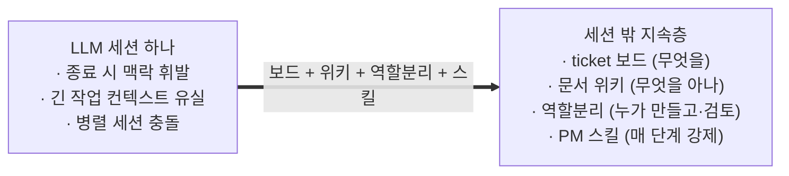
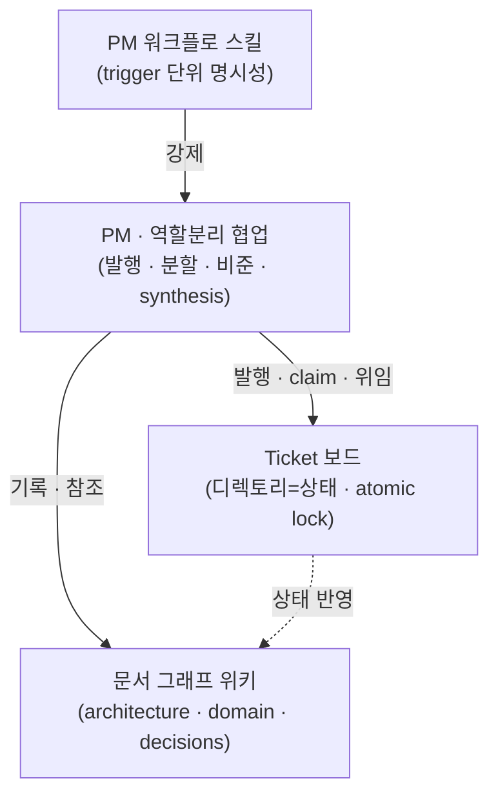
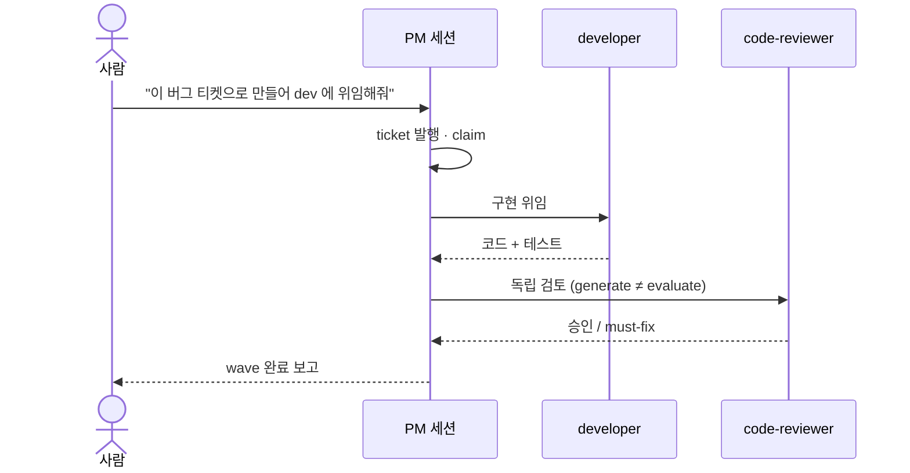
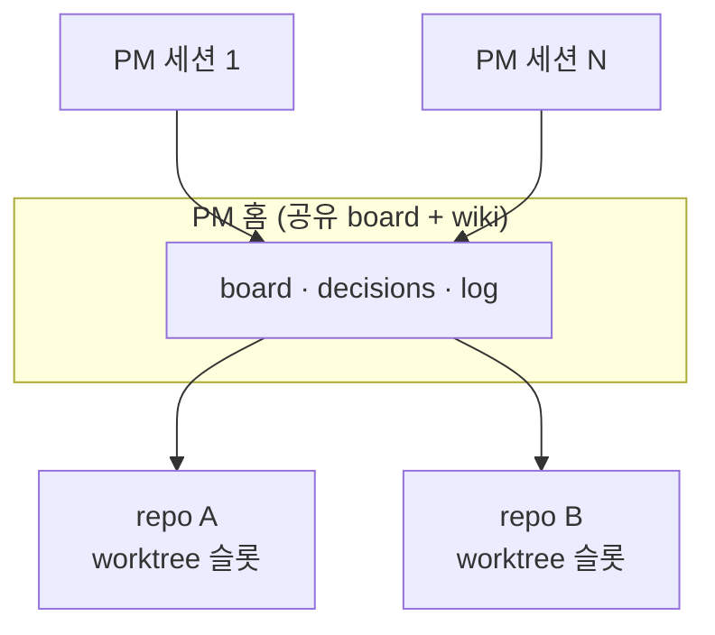

# Claude Project Framework

LLM 에이전트로 프로젝트를 운영하기 위한 얇은 계층. 세션이 끝나도 남는 ticket 보드, 문서
위키, 만드는 쪽과 검토하는 쪽을 나누는 역할 분리, 반복 절차를 강제하는 PM 스킬로 구성된다.
새 프로젝트는 어댑터 트리 하나를 import 하고 placeholder 를 채우면 같은 운영 프로세스를
그대로 쓴다.

실전 멀티-에이전트 프로젝트에서 100개가 넘는 ticket 과 30개가 넘는 ADR 을 거치며 검증한
운영 방식을 도메인 무관 템플릿으로 추출한 것이다.

이 문서는 사람을 위한 개요다. 에이전트의 진입점은 [`CLAUDE.md`](CLAUDE.md)(claude_code) 와
`AGENTS.md`(opencode) 이고, 세부 절차는 [`docs/`](docs/) 와 각 타깃 README 에 있다(아래 문서 절).

## 왜 만들었나

LLM 세션은 닫으면 맥락이 사라진다. 긴 작업은 컨텍스트 한계에 걸려 흐름이 끊기고, 여러
세션이 같은 트리를 동시에 건드리면 충돌한다.

그래서 작업과 지식과 절차를 세션 바깥에 둔다. 무엇을 할지는 ticket 보드가, 무엇을 알고
있는지는 위키가, 누가 만들고 누가 검토하는지는 역할 분리가, 각 단계에서 무엇을 해야
하는지는 스킬이 세션과 무관하게 유지한다.



## 특징

| 구성 요소 | 무엇 | 핵심 파일 |
|---|---|---|
| Ticket 보드 | 여러 LLM 세션이 충돌 없이 병렬 작업하는 가벼운 작업 보드. 디렉토리가 상태고 `mv` 가 atomic lock 이다. | `.project_manager/tools/board.py` |
| 문서 위키 | architecture.md(현재 아키텍처의 단일 진실), domain 지식 레이어(코드에 연결된 살아있는 페이지), decisions(ADR), 상태·일지. `[[wikilink]]` 와 frontmatter 로 엮인다. | `.project_manager/wiki/` |
| 역할 분리 | PM 세션이 ticket 을 발행하고 researcher(조사), architect(설계), developer(구현), code-reviewer(검토) 네 축에 위임한다. 만든 주체가 검토하지 않고, 결정과 종합은 PM 이 한다. | 어댑터층(`.claude/agents/` 등), `pm_role.md` |
| PM 스킬 | 부트스트랩, claim, 위임, finish, 핸드오프 같은 반복 워크플로를 단계 단위로 강제한다. | `.project_manager/tools/pm_*.py`, 어댑터층 |

코드를 고치면 그 코드를 `covers:` 로 걸어 둔 domain 페이지가 소환되고, 작업하며 배운 것은
`domain capture` 로 페이지에 적는다. 코드가 페이지보다 새로워지면 stale 표시가 붙는다.
네 구성 요소 모두 도메인 내용을 모르기 때문에 어느 프로젝트에나 이식된다.



## 설치

프레임워크 checkout 루트(`<manager>`)에서 새 프로젝트를 만든다. `--harness both` 를
권장한다(어댑터 둘 다 설치, 엔진은 공유):

```bash
<manager>/pm-import.sh --new <my-project> --harness both      # 권장
<manager>/pm-import.sh --new <my-project> --harness claude    # 하나만: claude | opencode
```

에이전트에게 채택 자체를 맡기려면 [`ADOPT.md`](ADOPT.md), 손으로 밟으려면
[`docs/manual-import.md`](docs/manual-import.md), 기존 프로젝트에 얹으려면 `--into`.

## 사용법

1. **세션 열기** — 새 프로젝트 폴더에서 `claude` 또는 `opencode` 를 실행한다.
2. **부트스트랩** — 세션에 `/pm-bootstrap` 을 입력한다. 보드와 git, 일지 상태가 나오고
   다음 할 일을 제안받는다.
3. **위임** — 이후는 자연어로 지시하면 된다. ticket 발행과 위임, 완료 처리는 PM 세션이
   한다. `board.py` 같은 CLI 는 에이전트가 치는 것이라 사람이 외울 필요 없다.

사람이 실제로 입력하는 것은 이런 정도다.

세션을 시작하며 보드·git·일지 상태를 받아본다:

```text
/pm-bootstrap
```

할 일이 생기면 티켓으로 등록한다:

```text
결제 취소가 두 번 청구되는 버그를 티켓으로 만들어줘.
```

구현과 검토를 에이전트에게 맡긴다. 만든 쪽과 검토하는 쪽은 자동으로 분리된다:

```text
그 티켓 dev 에게 위임해서 구현하고, 끝나면 리뷰어로 검토까지 돌려줘.
```

열린 티켓이 쌓여 있으면 한꺼번에 처리시킨다:

```text
wave 진행해줘 — 열린 티켓 최대한 많이.
```

세션을 마칠 때는 다음 세션이 이어받을 수 있게 인계 기록을 남긴다:

```text
/pm-handoff
```

한 wave 에서 PM 은 researcher, architect, developer, code-reviewer 네 축에 일을 나눠 주고
결과를 종합한다:



## 멀티-PM

여러 repo 를 하나의 PM 홈(공유 보드와 위키)에 묶어 여러 세션이 같이 쓸 수 있다. N 세션 ×
M repo 구성이고, 혼자 한 repo 만 쓰면 오버헤드 없이 solo 로 동작한다. 셋업과 조회는 루트의
`pm-config.sh` 하나로 하고, 각 프로젝트는 worktree 슬롯으로 붙인다. 상세는
[`docs/multi-repo.md`](docs/multi-repo.md).



## 디렉토리 구조

엔진(`.project_manager/`)은 모든 타깃이 공유하고, 어댑터층만 하니스마다 다르다:

```
<프로젝트 루트>/
├── (진입 문서)                 # claude_code: CLAUDE.md · opencode: AGENTS.md
├── .project_manager/           # 공유 엔진 (숨김 — ls -a)
│   ├── tools/                  #   board.py · domain.py · ticket_finish.py · pm_*.py
│   └── wiki/                   # 문서 위키
│       ├── architecture.md     #   현재 아키텍처의 단일 진실
│       ├── status.md           #   활성 모듈 매트릭스
│       ├── domain/             #   살아있는 지식 레이어 (covers 로 코드 추적)
│       ├── decisions/          #   ADR — 결정과 근거
│       ├── pm_role.md · pm_state.md · pm_playbook.md   # PM 운영 매뉴얼과 인계 상태
│       ├── log/                #   작업 일지 — current.md + archive/
│       ├── tickets/            #   open/ claimed/ blocked/ done/ + _template
│       └── specs/ · ideas/ · raw/                       # 사양 · 아이디어 · 스냅샷
└── (어댑터층)                  # claude_code: .claude/ · opencode: .opencode/  + 진입 문서
```

어댑터층은 그 하니스의 에이전트와 skill 정의, 진입 문서다. 세부는
[`templates/claude_code/README.md`](templates/claude_code/README.md) 와
[`templates/opencode/README.md`](templates/opencode/README.md).

## 문서

| 필요한 것 | 위치 |
|---|---|
| 수동 도입 절차 | [`docs/manual-import.md`](docs/manual-import.md) |
| placeholder 채우기 | [`docs/placeholders.md`](docs/placeholders.md) |
| 이식성 등급 | [`docs/portability.md`](docs/portability.md) |
| multi-repo 운용 | [`docs/multi-repo.md`](docs/multi-repo.md) |
| 에이전트용 채택 가이드 | [`ADOPT.md`](ADOPT.md) |
| 에이전트 진입점 | [`CLAUDE.md`](CLAUDE.md) · `AGENTS.md` |
| PM 운영 매뉴얼 | `.project_manager/wiki/pm_role.md` · `pm_state.md` · `pm_playbook.md` |
| 하니스별 어댑터 세부 | [`templates/claude_code/`](templates/claude_code/README.md) · [`templates/opencode/`](templates/opencode/README.md) |

도입 후 엔진 갱신은 채택자 루트에서 `./pm-update.sh` 로 받는다. manifest 에 있는 경로만
덮어쓰므로 인스턴스 상태는 건드리지 않는다. 외부 코드리뷰는 기본 꺼져 있고, 켜면 코드
diff 가 외부로 전송되므로 프로젝트가 직접 opt-in 을 결정한다.

## 크레딧

- Ticket 보드 — 디렉토리가 곧 상태고 `mv` 가 곧 lock 이다. 의도된 단순함.
- 문서 위키 — Andrej Karpathy 의 LLM Wiki 패턴을 계승하되, 정적 지식 베이스가 아니라
  ticket 을 따라 자라는 운영 계층으로 바꿨다.
- 역할 분리 — 만든 주체가 검토하지 않는다(generate ≠ evaluate).
- PM 스킬 — Junu Jeon 의 "How to Ride Your Horse" SDLC skill chain 에서 영감을 받았다.
  자동화 장치가 아니라 각 단계를 명시적으로 밟게 하는 장치다.

공개 제품이 아니라 개인 생산성 도구이고, 사내에 가볍게 공유하는 정도를 상정한다. 되돌리기
어려운 결정(자본, 안전 한도, 외부 송신 같은 것)은 자동화하지 않고 사용자 게이트로 남긴다.
