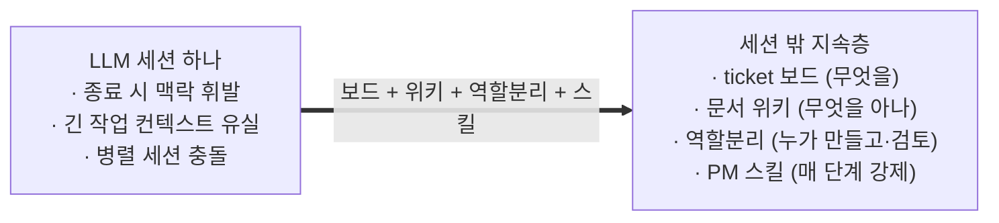
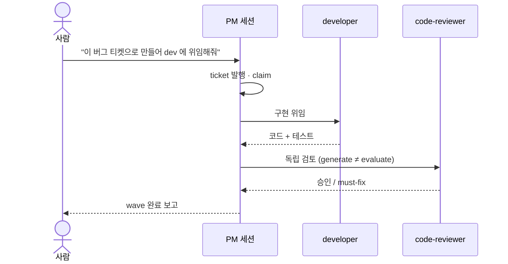
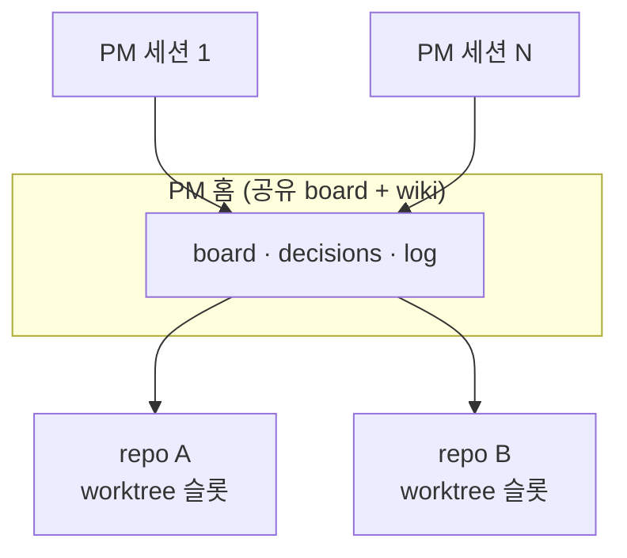

# Claude Project Framework

> **LLM 에이전트로 프로젝트를 운영하는 얇은 계층.** 세션이 죽어도 살아남는 **ticket 보드** + **문서
> 그래프 위키** + **PM·Researcher·Architect·Dev·Reviewer 역할분리** + **PM workflow 스킬**. 새 프로젝트는
> 어댑터 한 트리를 import 하고 placeholder 만 채우면 같은 운영 프로세스를 그대로 쓴다.

실전 멀티-에이전트 프로젝트에서 100+ ticket·30+ ADR 을 거치며 검증된 운영 계층을 도메인 무관 템플릿으로
추출했다. "구조"와 "도메인 내용"이 처음부터 분리돼 설계돼 이식 장벽이 낮다.

> 이 문서는 **사람**(첫 방문자·미래의 나·동료) 을 위한 개요다. **에이전트**의 진입은
> [`CLAUDE.md`](CLAUDE.md)(claude_code) / `AGENTS.md`(opencode) 가 맡고, 세부 절차는 [`docs/`](docs/) 와
> 각 타깃 README 에 있다 (§6 문서 지도).

---

## 1. 왜 필요한가

LLM 세션은 **휘발**한다 — 닫으면 맥락이 사라지고, 긴 작업은 컨텍스트가 넘쳐 유실되며, 여러 세션이
같은 트리를 동시에 건드리면 충돌한다. 이 프레임워크는 **작업·지식·결정·워크플로를 세션 밖 지속층**으로
빼낸다: ticket 보드가 무엇을 할지, 위키가 무엇을 아는지, 역할분리가 누가 만들고 누가 검토하는지,
스킬이 매 단계 무엇을 강제하는지를 세션을 넘어 붙잡는다.



---

## 2. 빠른 시작 (5분)

1. **Import (설치 1줄)**: 프레임워크 checkout 루트(`<manager>`)에서 새 프로젝트 생성 —
   **`--harness both` 권장** (Claude Code + opencode 어댑터 모두·엔진은 공유):
   ```bash
   <manager>/pm-import.sh --new <my-project> --harness both      # 권장 — 두 하니스 모두
   <manager>/pm-import.sh --new <my-project> --harness claude    # 하나만: claude | opencode
   ```
   (LLM 에이전트의 자율 채택 → [`ADOPT.md`](ADOPT.md) · 수동 절차 →
   [`docs/manual-import.md`](docs/manual-import.md) · 기존 프로젝트에 얹기 → `--into`)
2. **하니스 세션 Open**: 새 프로젝트 폴더에서 `claude` 또는 `opencode` 실행.
3. **부트스트랩**: 세션에 `/pm-bootstrap` 입력 — board·git·log 상태 dump + 다음 수 제안.
4. **위임 시작**: 이후는 **자연어 지시** — ticket 발행·위임·완료는 PM 세션이 운전.
   (`board.py` 같은 CLI 는 *에이전트* 몫 — 사람이 외울 필요 없음.)

사람이 하니스에 입력하는 예:

```text
/pm-bootstrap
결제 취소가 두 번 청구되는 버그를 티켓으로 만들어줘.
그 티켓 dev 에게 위임해서 구현하고, 끝나면 리뷰어로 검토까지 돌려줘.
wave 진행해줘 — 열린 티켓 최대한 많이.
핸드오프.
```

한 wave 안에서 PM 이 4축(researcher·architect·developer·code-reviewer)에 위임하고 결과를 종합한다:



---

## 3. 구성 요소 — 네 기둥

| 기둥 | 무엇 | 핵심 파일 |
|---|---|---|
| **① Ticket 보드 (JIRA)** | 여러 LLM 세션이 충돌 없이 병렬 작업하는 가벼운 작업 보드. 디렉토리 = 상태, `mv` = atomic lock. | `.project_manager/tools/board.py` |
| **② 문서 그래프 위키 (3축)** | 운영 계층 — **architecture.md**(현재-아키텍처 단일 진실·ADR-0022) + **domain 지식 레이어**(`covers:` 코드 글롭으로 그 세부를 살아있게 유지·ADR-0018) + decisions/spikes + process(상태·사양·일지). `[[wikilink]]` + frontmatter (Karpathy LLM-Wiki 패턴 계승). | `.project_manager/wiki/` |
| **③ 역할분리 협업** | PM 세션이 ticket 을 발행·분할하고 4축(gather=researcher / design=architect / build=developer / evaluate=code-reviewer)에 위임 (ADR-0019). **generate ≠ evaluate**·**design labor ≠ decision** — 결정·비준·synthesis 는 PM. | 어댑터층(`.claude/agents/`·`.opencode/agents/`), `pm_role.md` |
| **④ PM workflow 스킬** | PM 의 반복 workflow(부트스트랩 / claim / 위임 / finish / 핸드오프)를 trigger 단위로 강제. backbone CLI(`pm_*.py`) + 어댑터 slash command. | `.project_manager/tools/pm_*.py`, 어댑터층 |

살아있는 domain 루프: 코드를 touch 하면 겹치는 페이지를 **소환**하고 `domain capture` 로 채록한다 —
`covers:` 코드가 페이지보다 나중에 바뀌면 **stale ⚠** 로 가시화된다(막지 않고 보이게).
설계 원칙 한 줄: **네 기둥 다 도메인을 모른다.**


---

## 4. 멀티-PM 운용 (N×M)

한 사용자가 여러 repo 를 하나의 **PM 홈**(공유 보드·위키) 아래 묶어 운용할 수 있다 —
**N 세션 × M repo**(ADR-0016). N=1·M=1 = 옛 solo(오버헤드 0). 셋업·조회·진단은 루트 `pm-config.sh`
한 파사드로, 각 프로젝트는 worktree 슬롯으로 attach 한다. 상세 → [`docs/multi-repo.md`](docs/multi-repo.md).



---

## 5. 설치 후 디렉토리 구조

엔진(`.project_manager/`)은 모든 타깃이 공유하고, 어댑터층만 하니스마다 다르다:

```
<프로젝트 루트>/
├── (진입 문서)                 # claude_code: CLAUDE.md · opencode: AGENTS.md
├── .project_manager/           # 공유 엔진 (숨김 — ls -a)
│   ├── tools/                  #   board.py(①) · domain.py(②) · ticket_finish.py · pm_*.py(④)
│   └── wiki/                   # ② 문서 그래프 위키
│       ├── architecture.md     #   현재-아키텍처 단일 진실 (부트스트랩 #1 · ADR-0022)
│       ├── status.md           #   활성 모듈 매트릭스 (judgment-only · ADR-0023)
│       ├── domain/             #   살아있는 지식 레이어 (covers 로 코드 추적)
│       ├── decisions/          #   ADR — 결정과 근거 (NNNN-slug + README 색인)
│       ├── pm_role.md · pm_state.md · pm_playbook.md   # PM 인계 (정적·동적·플레이북)
│       ├── log/                #   작업 일지 — current.md + archive/
│       ├── tickets/            #   open/ claimed/ blocked/ done/ + _template
│       └── specs/ · ideas/ · raw/                       # 사양 · pre-ADR · immutable 스냅샷
└── (어댑터층)                  # claude_code: .claude/ · opencode: .opencode/  + 진입 문서
```

어댑터층 = 그 하니스의 에이전트·skill 정의 + 진입 문서. 세부는
[`templates/claude_code/README.md`](templates/claude_code/README.md) ·
[`templates/opencode/README.md`](templates/opencode/README.md).

---

## 6. 문서 지도

| 무엇이 필요하면 | 어디로 |
|---|---|
| 사람 — 수동 도입 절차 | [`docs/manual-import.md`](docs/manual-import.md) |
| 사람 — placeholder 채우기 | [`docs/placeholders.md`](docs/placeholders.md) |
| 사람 — 이식성 등급 (뭘 고쳐야 하나) | [`docs/portability.md`](docs/portability.md) |
| 사람 — multi-repo (N×M) 운용 | [`docs/multi-repo.md`](docs/multi-repo.md) |
| 에이전트 — 채택 자율 수행 | [`ADOPT.md`](ADOPT.md) |
| 에이전트 — 진입 (claude / opencode) | [`CLAUDE.md`](CLAUDE.md) · `AGENTS.md` |
| PM 운영 매뉴얼 (정적·동적) | `.project_manager/wiki/pm_role.md` · `pm_state.md` · `pm_playbook.md` |
| 하니스별 어댑터 세부 | [`templates/claude_code/`](templates/claude_code/README.md) · [`templates/opencode/`](templates/opencode/README.md) |

> 도입 후 엔진 갱신은 채택자 루트에서 `./pm-update.sh`(manifest 경로만 byte-overwrite — 인스턴스
> 상태는 안 받는다). 외부 코드리뷰(선택·기본 OFF·ADR-0004)는 `external_review.py` — 코드 diff 가
> 외부로 전송되므로 프로젝트가 opt-in 을 결정한다.

---

## 7. 계보 / 포지셔닝

**Ticket 보드**(디렉토리=상태 + POSIX `rename(2)` atomic lock·의도된 단순성) · **문서 그래프
위키**(Andrej Karpathy 의 LLM Wiki 패턴 계승 — 단, 정적 KB 가 아니라 ticket 주도로 자라는 운영
계층으로 재정의) · **역할분리**(generate ≠ evaluate 로 구현자 맹점을 검토자가 잡음) · **PM
skill**(Junu Jeon "How to Ride Your Horse" SDLC skill chain 에서 영감 — 자동화 부산물이 아니라
*명시성 강제* 메커니즘으로 재해석).

포지셔닝: 공개 마케팅 제품이 아니라 **개인 force-multiplier + 사내 가벼운 공유** 도구다. 개발·관리
프로세스 자동화로 사용자 개입을 줄이되, 도메인의 비가역·미션 결정(자본·안전 한도·외부 송신 등)은
자동화 비대상·영구 사용자 게이트로 남긴다.
