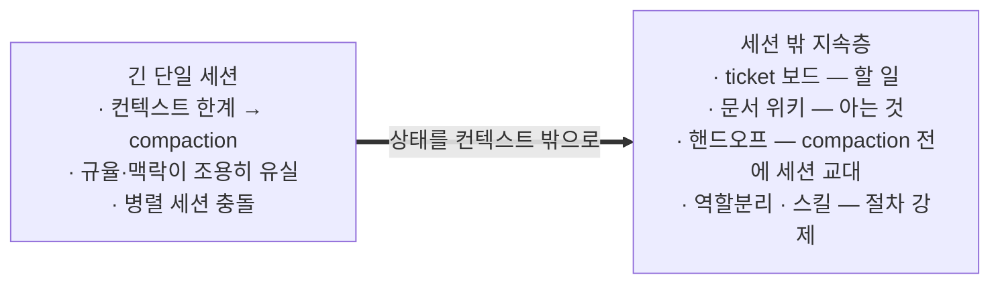
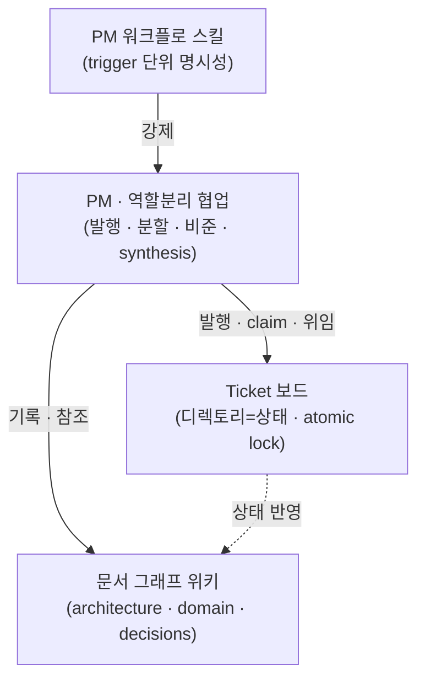
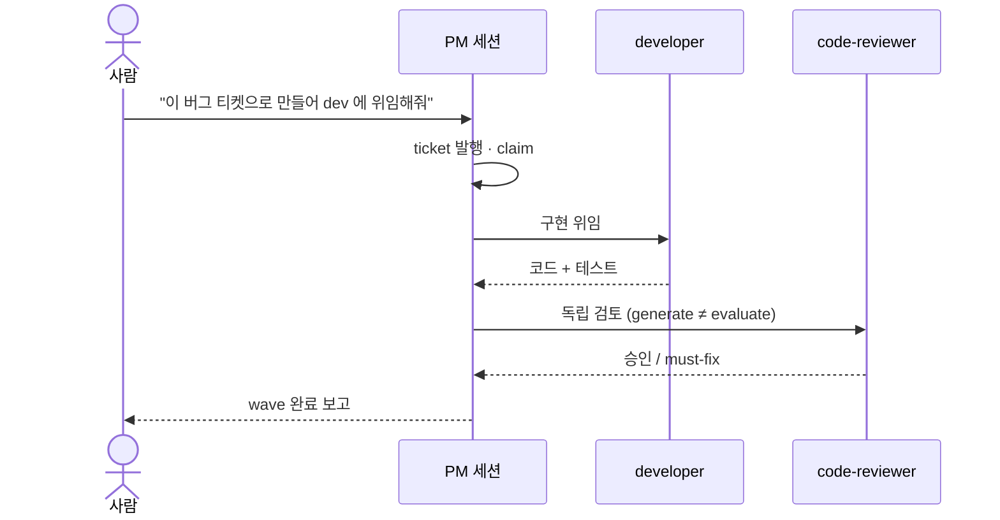
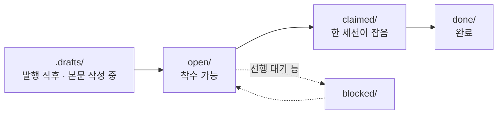
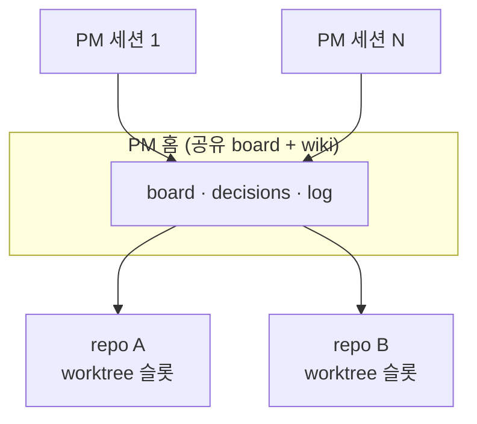

# Claude Project Framework

LLM 에이전트로 프로젝트를 운영하기 위한 얇은 계층. 세션이 끝나도 남는 ticket 보드, 문서
위키, 만드는 쪽과 검토하는 쪽을 나누는 역할 분리, 반복 절차를 강제하는 PM 스킬로 구성된다.
새 프로젝트는 어댑터 트리 하나를 import 하고 placeholder 를 채우면 같은 운영 프로세스를
그대로 쓴다.

실전 멀티-에이전트 프로젝트에서 100개가 넘는 ticket 과 30개가 넘는 ADR 을 거치며 검증한
운영 방식을 도메인 무관 템플릿으로 추출한 것이다.

이 문서는 사람을 위한 개요다. 에이전트의 진입점은 [`CLAUDE.md`](CLAUDE.md)(claude_code) 와
`AGENTS.md`(opencode) 이고, 세부 절차는 [`docs/`](docs/) 와 각 타깃 README 에 있다(아래 문서 절).

---

## 왜 만들었나

LLM 세션의 컨텍스트는 유한하다. 한계에 다가가면 하니스가 대화를 요약해 압축하는데
(compaction), 이때 세션이 지키던 것들 — 작업 절차, 프로젝트 규율, 하던 일의 맥락 — 이
조용히 뭉개진다. 요약을 넘겨받은 세션은 겉보기엔 이어지는 것 같지만 규율을 잃은 다른
세션이다. 여기에 더해 여러 세션이 같은 트리를 동시에 건드리면 충돌한다.

그래서 이 프레임워크의 첫째 목표는 compaction 을 겪지 않는 것이다. 상태를 컨텍스트가
아니라 세션 바깥에 둔다:

- 무엇을 할지는 ticket 보드(JIRA 방식)가 갖는다. 세션은 티켓 단위로만 일해서 컨텍스트를
  길게 끌고 갈 필요가 없다.
- 무엇을 알고 있는지는 위키가 갖는다. 다음 세션은 요약이 아니라 문서에서 복원한다.
- 컨텍스트가 임계에 오면 핸드오프 트리거가 요약당하기 전에 세션을 끊고, 인계 기록을 남겨
  새 세션으로 잇는다.
- 누가 만들고 누가 검토하는지는 역할 분리가, 각 단계의 절차는 스킬이 강제한다.



---

## 특징

| 구성 요소 | 무엇 | 핵심 파일 |
|---|---|---|
| Ticket 보드 | 여러 LLM 세션이 충돌 없이 병렬 작업하는 가벼운 작업 보드. 디렉토리가 상태고 `mv` 가 atomic lock 이다. | `.project_manager/tools/board.py` |
| 문서 위키 | architecture.md(현재 아키텍처의 단일 진실), domain 지식 레이어(코드에 연결된 살아있는 페이지), decisions(ADR), 상태·일지. `[[wikilink]]` 와 frontmatter 로 엮인다. | `.project_manager/wiki/` |
| 역할 분리 | PM 세션이 ticket 을 발행하고 researcher(조사), architect(설계), developer(구현), code-reviewer(검토) 네 축에 위임한다. 만든 주체가 검토하지 않고, 결정과 종합은 PM 이 한다. | 어댑터층(`.claude/agents/` 등), `pm_role.md` |
| PM 스킬 | 부트스트랩, claim, 위임, finish, 핸드오프 같은 반복 워크플로를 단계 단위로 강제한다. | `.project_manager/tools/pm_*.py`, 어댑터층 |

네 구성 요소 모두 도메인 내용을 모르기 때문에 어느 프로젝트에나 이식된다.



---

## 설치

프레임워크 checkout 루트(`<manager>`)에서 새 프로젝트를 만든다. `--harness both` 를
권장한다(어댑터 둘 다 설치, 엔진은 공유):

```bash
<manager>/pm-import.sh --new <my-project> --harness both      # 권장
<manager>/pm-import.sh --new <my-project> --harness claude    # 하나만: claude | opencode
```

에이전트에게 채택 자체를 맡기려면 [`ADOPT.md`](ADOPT.md), 손으로 밟으려면
[`docs/manual-import.md`](docs/manual-import.md), 기존 프로젝트에 얹으려면 `--into`.

---

## 사용법

1. **세션 열기** — 새 프로젝트 폴더에서 `claude` 또는 `opencode` 를 실행한다.
2. **부트스트랩** — 보드와 git, 일지 상태를 받고 다음 할 일을 제안받는다:

```text
/pm-bootstrap
```

3. **위임** — 이후는 자연어로 지시하면 된다. ticket 발행과 위임, 완료 처리는 PM 세션이
   한다. `board.py` 같은 CLI 는 에이전트가 치는 것이라 사람이 외울 필요 없다. 기능별
   프롬프트 예시는 아래 각 절에 있다.

한 wave 에서 PM 은 researcher, architect, developer, code-reviewer 네 축에 일을 나눠 주고
결과를 종합한다:



세션을 마칠 때, 또는 컨텍스트가 차서 compaction 당하기 전에, 다음 세션이 이어받을 수 있게
인계 기록을 남긴다:

```text
/pm-handoff
```

---

## 티켓의 수명

티켓은 디렉토리 사이를 이동하며 상태가 바뀐다. 디렉토리가 곧 상태라서 별도 DB 없이 `mv` 가
atomic lock 역할을 한다.



- **발행** — 티켓은 draft 로 시작한다. 목표와 완료 조건이 채워지기 전에는 공유 보드에
  올라가지 않고, 본문을 채워 promote 해야 open 이 된다.
- **claim** — 세션이 티켓을 잡으면 그 세션 명의로 귀속된다. 이미 잡힌 티켓은 다른 세션이
  잡을 수 없다 (병렬 충돌 방지). `depends_on` 으로 선후를 걸어 두면 선행이 끝나기 전에는
  잡지 않는다.
- **완료** — 구현과 검토가 끝나면 done 으로 옮긴다. 테스트 통과가 완료 조건이고, 완료
  시각과 세션이 티켓에 남아 나중에 "언제 누가 무엇을 했나"를 board 에서 되짚을 수 있다.

할 일이 생기면 티켓으로 등록한다:

```text
결제 취소가 두 번 청구되는 버그를 티켓으로 만들어줘.
```

구현과 검토를 맡긴다. 만든 쪽과 검토하는 쪽은 자동으로 분리된다:

```text
그 티켓 dev 에게 위임해서 구현하고, 끝나면 리뷰어로 검토까지 돌려줘.
```

열린 티켓이 쌓여 있으면 한꺼번에 처리시킨다:

```text
wave 진행해줘 — 열린 티켓 최대한 많이.
```

---

## Spike 와 ADR

굳혀야 할 설계 결정은 두 단계로 남긴다.

**Spike** 는 설계 과정의 기록이다. 세션이 혼자 결정하지 않고, 실측한 현황과 옵션을 사용자와
한 절씩 합의하며 문서로 다듬는다. 합의가 끝나면 봉인해서(sealed) 불변 기록이 되고, 이후
개정은 새 파일로 쌓인다.

**ADR**(Architecture Decision Record) 은 spike 에서 굳힌 결정의 요약이다. 무엇을 왜 그렇게
정했고 어떤 대안을 기각했는지가 번호로 남는다. 현재 구조의 단일 진실은 architecture.md 가
갖고, ADR 은 "왜 이렇게 만들었나"의 역사를 맡는다. 시간이 지나 맥락을 잃은 세션도 결정의
근거를 문서에서 복원할 수 있다 — compaction 으로 잃기 쉬운 것이 바로 이 결정의 맥락이다.

진행은 대화다. 주제를 열면:

```text
멀티 세션 정체성 문제를 설계 spike 로 다뤄줘.
```

세션이 코드와 데이터를 실측해 현황을 보고하고 scope 를 확정한 뒤, 옵션 A/B 를 장단점과
권고와 함께 제시한다. 사람은 한 절씩 결정해 간다:

```text
A안으로 가자. 훅은 권고안대로.
```

모든 절이 합의되면 사인오프로 봉인(sealed)하고, 굳힌 결정을 ADR 과 구현 티켓으로 발행시킨다:

```text
사인오프. ADR 발행하고 구현 티켓으로 쪼개서 진행해줘.
```

---

## Domain 지식

작업하며 알게 된 도메인 지식은 위키의 domain 페이지로 쌓는다. 페이지는 `covers:` 로 코드
글롭에 연결돼 있어서, 그 코드를 고치면 관련 페이지가 소환되고, 코드가 페이지보다 새로워지면
stale 표시가 붙는다. 배운 것은 `domain capture` 로 페이지에 적는다. 지식이 정적 문서로
죽지 않고 코드를 따라 산다.

```text
이번에 파악한 결제 취소 흐름을 domain 페이지로 채록해줘.
```

---

## 에이전트 구성

PM 이 메인 세션이고, 일은 네 축의 서브에이전트에 나눠 준다. 만든 주체가 검토하지 않는다는
분리가 핵심이다.

| 에이전트 | 하는 일 | 하지 않는 일 |
|---|---|---|
| PM (메인 세션) | ticket 발행·분할·위임·비준, 보드와 일지 부기. 결정과 종합은 여기서만 한다. | 직접 구현 (위임이 원칙) |
| researcher | 여러 파일과 레퍼런스를 훑어 사실만 수집해 온다 (read-only). | 코드·문서 수정 |
| architect | 설계 노동 — 옵션 분석, ADR/스펙 초안, 인터페이스 설계. | 결정·발행 (비준은 PM) |
| developer | 티켓 하나를 코드와 테스트로 구현한다. | 보드 조작, 일지 갱신 |
| code-reviewer | developer 의 변경을 독립 검토하고 승인/must-fix 를 낸다. | 코드 수정 |

모델은 어댑터 정의에서 정한다. Claude Code 는 `.claude/agents/<역할>.md` frontmatter 의
`model:` 로 (기본 opus), opencode 는 `.opencode/agents/<역할>.md` 가 `local.conf` 의
`opencode_pro_model` 값으로 렌더된다. 역할별 모델을 바꾸고 싶으면 여기만 고치면 된다.

보드와 엔진이 하니스 중립이라 `--harness both` 로 깔면 섞어 쓸 수 있다. 예를 들어 PM 세션은
Claude Code 로 열고 구현 세션은 opencode 로 열어, 같은 ticket 보드를 나눠 잡는 구성이 된다.

---

## 멀티-PM

여러 repo 를 하나의 PM 홈(공유 보드와 위키)에 묶어 여러 세션이 같이 쓸 수 있다. N 세션 ×
M repo 구성이고, 혼자 한 repo 만 쓰면 오버헤드 없이 solo 로 동작한다. 셋업과 조회는 루트의
`pm-config.sh` 하나로 하고, 각 프로젝트는 worktree 슬롯으로 붙인다. 상세는
[`docs/multi-repo.md`](docs/multi-repo.md).

멀티-PM 에서는 세션이 부트스트랩할 때 repo 와 슬롯을 지정해 "나는 이 repo 의 N 번 PM" 이라고
선언한다. 이후 그 세션의 작업 위치와 보드 조작 귀속이 그 슬롯으로 잡힌다:

```text
/pm-bootstrap repo-a --slot 2
```



---

## 디렉토리 구조

엔진(`.project_manager/`)은 모든 타깃이 공유하고, 어댑터층만 하니스마다 다르다:

```
<프로젝트 루트>/
├── (진입 문서)                 # claude_code: CLAUDE.md · opencode: AGENTS.md
├── .project_manager/           # 공유 엔진 (숨김 — ls -a)
│   ├── tools/                  #   board.py · domain.py · ticket_finish.py · pm_*.py
│   └── wiki/                   # 문서 위키
│       ├── architecture.md     #   현재 아키텍처의 단일 진실
│       ├── status.md           #   활성 모듈 매트릭스
│       ├── domain/             #   살아있는 지식 레이어 (covers 로 코드 추적)
│       ├── decisions/          #   ADR — 결정과 근거
│       ├── pm_role.md · pm_state.md · pm_playbook.md   # PM 운영 매뉴얼과 인계 상태
│       ├── log/                #   작업 일지 — current.md + archive/
│       ├── tickets/            #   open/ claimed/ blocked/ done/ + _template
│       └── specs/ · ideas/ · raw/                       # 사양 · 아이디어 · 스냅샷
└── (어댑터층)                  # claude_code: .claude/ · opencode: .opencode/  + 진입 문서
```

어댑터층은 그 하니스의 에이전트와 skill 정의, 진입 문서다. 세부는
[`templates/claude_code/README.md`](templates/claude_code/README.md) 와
[`templates/opencode/README.md`](templates/opencode/README.md).

---

## 문서

| 필요한 것 | 위치 |
|---|---|
| 수동 도입 절차 | [`docs/manual-import.md`](docs/manual-import.md) |
| placeholder 채우기 | [`docs/placeholders.md`](docs/placeholders.md) |
| 이식성 등급 | [`docs/portability.md`](docs/portability.md) |
| multi-repo 운용 | [`docs/multi-repo.md`](docs/multi-repo.md) |
| 에이전트용 채택 가이드 | [`ADOPT.md`](ADOPT.md) |
| 에이전트 진입점 | [`CLAUDE.md`](CLAUDE.md) · `AGENTS.md` |
| PM 운영 매뉴얼 | `.project_manager/wiki/pm_role.md` · `pm_state.md` · `pm_playbook.md` |
| 하니스별 어댑터 세부 | [`templates/claude_code/`](templates/claude_code/README.md) · [`templates/opencode/`](templates/opencode/README.md) |

도입 후 엔진 갱신은 채택자 루트에서 `./pm-update.sh` 로 받는다. manifest 에 있는 경로만
덮어쓰므로 인스턴스 상태는 건드리지 않는다. 외부 코드리뷰는 기본 꺼져 있고, 켜면 코드
diff 가 외부로 전송되므로 프로젝트가 직접 opt-in 을 결정한다.

---

## 크레딧

- Ticket 보드 — 디렉토리가 곧 상태고 `mv` 가 곧 lock 이다. 의도된 단순함.
- 문서 위키 — Andrej Karpathy 의 LLM Wiki 패턴을 계승하되, 정적 지식 베이스가 아니라
  ticket 을 따라 자라는 운영 계층으로 바꿨다.
- 역할 분리 — 만든 주체가 검토하지 않는다(generate ≠ evaluate).
- PM 스킬 — Junu Jeon 의 "How to Ride Your Horse" SDLC skill chain 에서 영감을 받았다.
  자동화 장치가 아니라 각 단계를 명시적으로 밟게 하는 장치다.

공개 제품이 아니라 개인 생산성 도구이고, 사내에 가볍게 공유하는 정도를 상정한다. 되돌리기
어려운 결정(자본, 안전 한도, 외부 송신 같은 것)은 자동화하지 않고 사용자 게이트로 남긴다.
