# Project Manager Framework

LLM 코딩 에이전트의 작업을 대화가 아니라 repo 안의 `board/wiki/log/ADR/domain`에 영속화해,
Claude Code·opencode·codex가 같은 프로젝트를 안전하게 이어받고 병렬로 진행하게 하는
harness-neutral PM 운영 프레임워크다.

실행 환경은 **Python 3.11 이상**이 필요하다(`tomllib` 표준 라이브러리가 지배 제약).

LLM 으로 하루짜리 수정은 쉽게 끝난다. 문제는 며칠짜리 프로젝트다. 세션이 compaction 되고,
어제의 결정이 사라지고, 여러 에이전트가 같은 파일을 고치며, 만든 주체가 스스로 검토한다.
이 프레임워크는 그 문제를 더 긴 프롬프트가 아니라 파일로 남는 운영 구조로 푼다.

실전 멀티-에이전트 프로젝트에서 260개 이상의 ticket 과 70개 이상의 ADR 을 거치며 다듬은
운영 방식을 도메인 무관 템플릿으로 추출했다.

이 문서는 사람을 위한 개요다. 에이전트의 진입점은 [`CLAUDE.md`](CLAUDE.md)(Claude Code) 와
`AGENTS.md`(opencode·codex) 이고, 세부 절차는 [`docs/`](docs/) 와 각 타깃 README 에 있다.

---

## 해결하는 문제

며칠짜리 LLM 프로젝트가 깨지는 근본 원인은 프로젝트 상태가 대화와 한 실행 환경 안에 갇혀 있기
때문이다. compaction 때 결정 근거가 사라지고, 한 하네스의 토큰·출력·권한 한계가 전체 작업을
멈추며, 병렬 세션은 소유권 없이 충돌하고, 구현한 세션이 스스로 검토하게 된다.

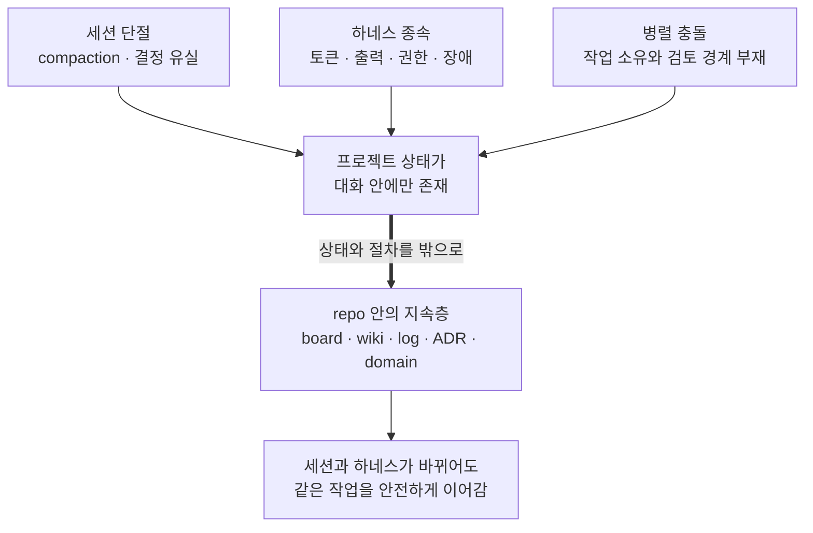

opencode 의 대용량 응답·write 잘림과 startup stall, Claude Code 의 컨텍스트 임계와 권한·훅 차이는
이 문제가 실제 하네스마다 다른 형태로 드러나는 사례다. 프레임워크는 이를 더 긴 프롬프트가 아니라
파일로 남는 상태, 역할 분리, 하네스별 안전장치로 다룬다.

---

## 무엇이 다른가

많은 도구는 agent 를 더 잘 실행하는 데 집중한다. 이 프레임워크는 실행 도구가 아니라, 여러
하네스가 같이 읽고 이어받을 수 있는 프로젝트 운영층을 repo 안에 둔다.

| 보통의 agent 실행 도구 | 이 프레임워크 |
|---|---|
| 특정 제품이나 하네스의 session 이 중심 | repo 안의 PM 홈이 중심 |
| 작업 흐름이 UI/대화 기록에 남음 | board/wiki/log/ADR/domain 파일에 남음 |
| agent 를 실행하고 결과를 받음 | PM 이 ticket 을 쪼개고, 역할을 위임하고, 검토와 핸드오프를 남김 |
| 한 도구의 장애·토큰·권한 모델에 묶이기 쉬움 | Claude Code, opencode, codex 가 같은 상태를 공유해 교차 사용 |
| 병렬 실행은 가능해도 소유·인계 규칙은 별도 설계 필요 | claim, task, slot, readonly slot, handoff 가 기본 운영 규칙 |

즉, agent 를 대체하거나 실행하는 제품이 아니라 agent 들이 오래 함께 일할 수 있게 만드는
repo-native 운영층이다.

---

## 구성

repo 안 PM 홈은 다섯 가지 부품으로 구성된다. 모두 도메인과 하네스에 독립적이라 기존 프로젝트에
그대로 이식할 수 있다.

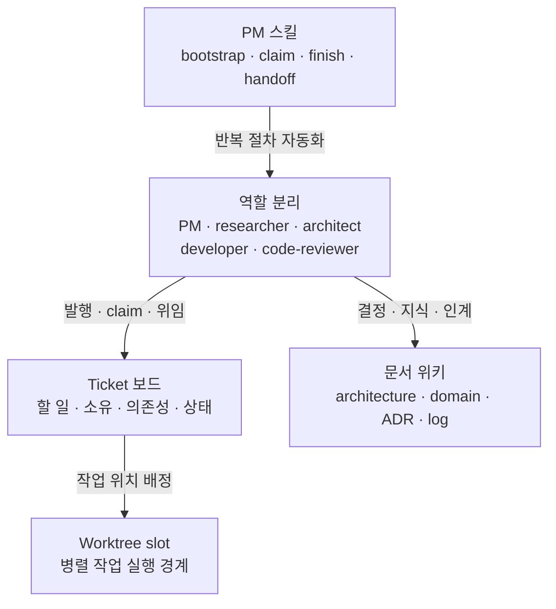

---

## 빠른 시작

도입이 끝난 프로젝트에서 사용자가 기억할 명령은 두 개다. 세션을 열 때 `/pm-bootstrap`,
넘길 때 `/pm-handoff`. 그 사이의 ticket 발행, claim, slot 대여, 위임, 검토, finish 는 PM 에게
자연어로 말하면 된다.

| 순간 | 사용자가 하는 일 |
|---|---|
| 세션 시작 | `/pm-bootstrap` 으로 현재 상태와 다음 선택지를 받는다. |
| 작업 중 | "티켓 만들어줘", "4번 slot 받아줘", "developer 에게 맡기고 검토해줘"처럼 말한다. |
| 세션 교대 | `/pm-handoff` 로 다음 세션이 이어받을 기록을 남긴다. |

### 1. 세션 열고 부트스트랩하기

새 프로젝트 폴더에서 `claude`, `opencode`, `codex` 중 원하는 하네스를 실행한 뒤:

```text
/pm-bootstrap
```

그러면 PM 세션이 board, git, 최근 log, 남은 작업을 읽고 다음 선택지를 제안한다.
사람이 `board.py` 플래그나 slot 명령을 외울 필요는 없다. 반복 절차는 PM 스킬과 엔진이 감싼다.

### 2. 자연어로 일 시키기

예를 들어:

```text
결제 취소가 두 번 청구되는 버그를 티켓으로 만들어줘.
```

```text
그 티켓 developer 에게 위임하고, 끝나면 reviewer 로 검토까지 돌려줘.
```

PM 은 ticket 을 발행하고, 필요하면 설계 spike 나 ADR 로 결정을 남기고, 구현과 검토를 분리해서
진행한다.

### 3. 다음 세션에 넘기기

```text
/pm-handoff
```

이 사용자 발화가 핸드오프의 명시 지시다. 스킬은 발화에서 승인된 task/slot 대상값을 backbone의
`--user-ack <값>`으로 그대로 전달하며, 세션이 승인값을 만들거나 자동 부착하지 않는다.

세션을 마칠 때는 다음 세션이 이어받을 산출물, 결정, 남은 작업, 테스트와 git 상태가 파일로
남는다. 프레임워크를 처음 넣는 절차는 아래 [도입과 엔진 관리](#도입과-엔진-관리)에 분리했다.
이 간단한 사용감 뒤에서는 다음 라이프사이클이 반복된다.

---

## 세션 라이프사이클

한 PM 세션은 부트스트랩으로 시작한다. 그 뒤에는 ticket 을 하나 처리하고 바로 끝날 수도 있고,
남은 컨텍스트가 충분하면 다음 ticket 으로 이어 갈 수도 있다. 세션을 넘겨야 할 때만 핸드오프를
남긴다.

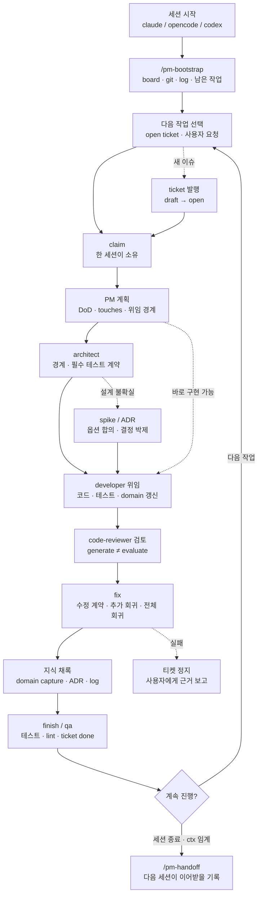

세션 안에서 자주 갈라지는 작업은 네 종류다.

| 상황 | 보통 하는 일 | 남는 기록 |
|---|---|---|
| 바로 구현 가능한 일 | ticket claim → architect → developer → reviewer → fix → finish | ticket done, log |
| 사실 확인이 필요한 일 | researcher 로 읽기 조사 → PM 이 종합 | log, domain research |
| 설계 결정이 필요한 일 | spike 로 옵션 합의 → ADR 발행 → 구현 ticket 분할 | spike, ADR, ticket |
| 작업 중 배운 지식 | 관련 `covers:` domain 페이지 갱신 | domain page, stale 해소 |

---

## 작업을 영속시키는 방식

이 프레임워크의 핵심 가치는 "긴 대화를 오래 붙잡는 것"이 아니라, 어느 세션이 끝나도 다음
세션이 같은 작업을 이어받을 수 있게 만드는 것이다. PM 세션은 진행 중인 판단을 대화 안에만
두지 않고, board, wiki, log, per-slot state 에 나눠 남긴다. 다음 세션은 `/pm-bootstrap` 으로
그 파일들을 다시 읽고 현재 작업 상태를 복원한다.

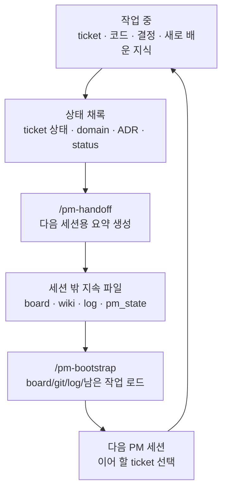

핸드오프와 부트스트랩은 서로 맞물린다. 앞 세션이 판단에 필요한 근거를 남기면, 다음 세션은 기억이나
긴 대화 요약이 아니라 저장된 현재 상태에서 시작한다.

| `/pm-handoff` 가 남기는 것 | `/pm-bootstrap` 이 인계받는 것 |
|---|---|
| 이번 세션 산출물과 완료·진행·막힌 ticket | board 의 open·claimed·blocked·done 상태 |
| 남은 작업과 권장 다음 액션 | pm_state 와 마지막 handoff 의 남은 작업 |
| 결정 근거, 사용자 판단, domain·ADR 갱신점 | AGENTS/CLAUDE, pm_role, architecture 의 운영·설계 기준 |
| 회귀, lint, branch, dirty, 최근 commit | git 상태와 회귀 baseline |
| 다음 세션용 인계 요약 | 현재 요약, 후보 작업, 사용자에게 물을 결정 |

사람은 시작과 교대 명령만 호출한다. 그 사이에는 "티켓 잡아줘", "developer 에게 맡겨줘",
"reviewer 로 검토해줘", "domain 에 남겨줘"처럼 요청하면 스킬과 엔진이 의존성 검사, claim,
위임 프롬프트, 테스트, 완료 기록과 지식 채록을 실행한다.

그래서 작업의 단위는 "한 대화"가 아니라 "파일에 남은 ticket 과 인계 상태"가 된다. Claude Code,
opencode, codex 중 어느 하네스로 다음 세션을 열어도 같은 board/wiki/log 를 읽기 때문에 이어받는
기준이 같다.

---

## 작업 흐름

한 wave 에서 PM 은 researcher, architect, developer, code-reviewer 네 축에 일을 나눠 주고
결과를 종합한다. 발표에서는 한 그림에 모두 넣기보다 유즈케이스별로 보면 이해하기 쉽다.

**조사만 필요한 경우**

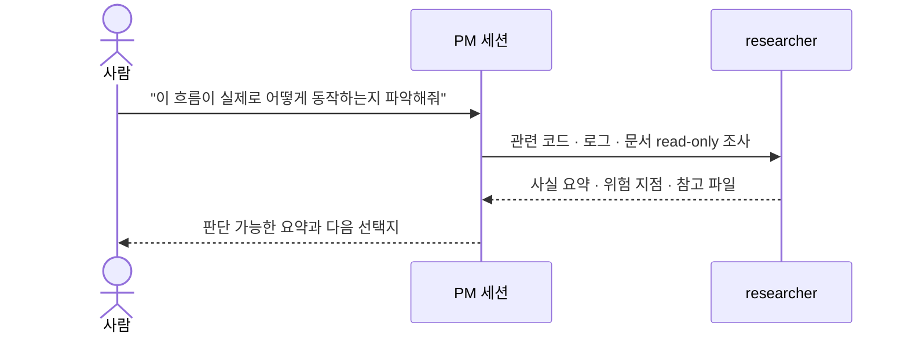

**설계 결정이 필요한 경우**

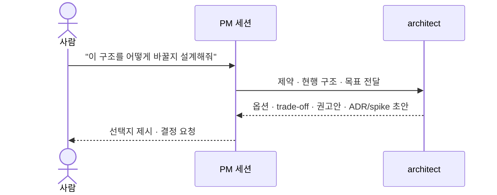

**구현과 검토가 필요한 경우**

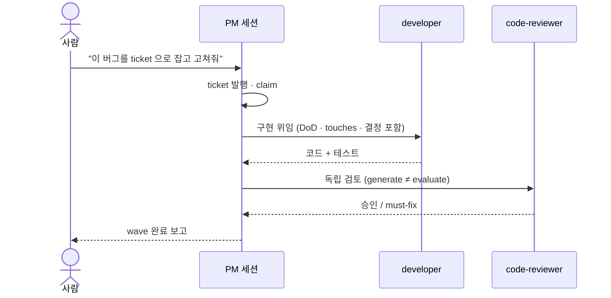

**작업 중 배운 것을 남기는 경우**

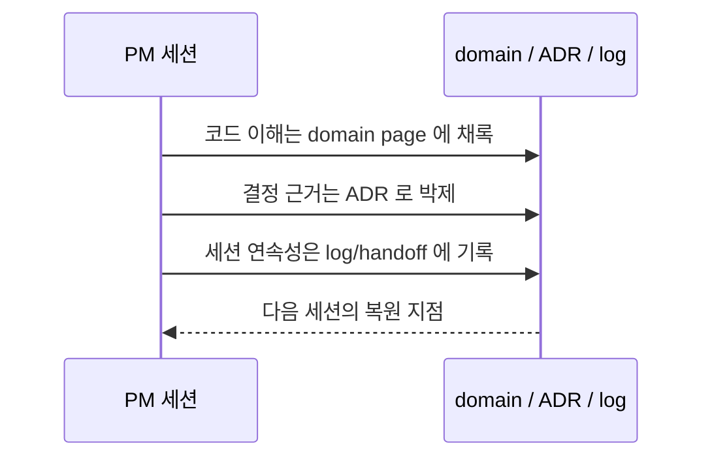

---

## Task 와 Slot

여기까지가 한 세션의 기본 흐름이다. 여러 세션이나 여러 repo 를 동시에 굴릴 때는 task 와 slot 으로
작업 흐름과 실제 코드 작업공간을 분리한다.

여러 repo 를 하나의 PM 홈(공유 보드와 위키)에 묶어 여러 세션이 같이 쓸 수 있다. 혼자 한 repo 만
쓰면 슬롯 1개짜리 홈이 되고 별도 설정이 필요 없다. 사용자는 보통 "4번
slot 받아서 doc task 로 작업하자"처럼 말하면 되고, PM 이 slot 대여와 보드 귀속을 처리한다.
상세는 [`docs/multi-repo.md`](docs/multi-repo.md)에 있다.

이때 용어가 둘 있다.

- **slot**: 실제 코드 작업공간이다. `work/<repo>_<N>` 형태의 git worktree 로 만들어지고,
  한 세션이나 task 가 빌려 쓴다.
- **task**: 사람이 붙이는 작업 흐름 이름이다. `doc`, `release`, `main` 처럼 부를 수 있고,
  slot 과 독립적이다. task 는 필요할 때 slot 을 빌리고, 끝나면 반납한다.

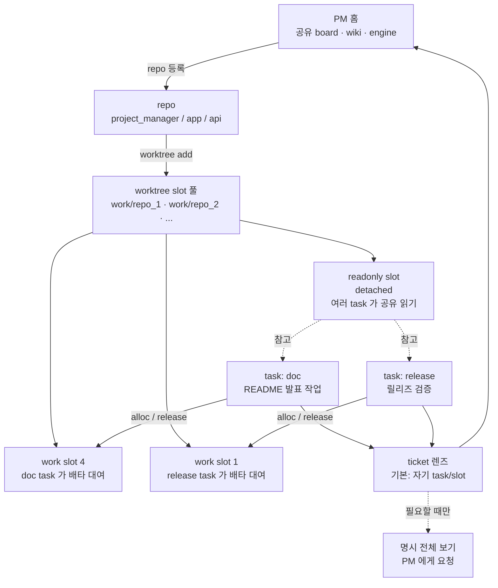

slot 을 새로 만드는 것은 코드 checkout 을 추가하는 물리 작업이라 사용자가 명시적으로 승인한다.
하지만 대여, 반납, task 종료, ticket prefix 같은 일상 조작은 보통 PM 에게 자연어로 요청한다.

```text
4번 slot 받아서 doc task 로 README 작업하자.
작업 끝났으면 doc task slot 반납까지 정리해줘.
```

slot 에 직접 바인딩해 일하는 방식도 있다. 세션이 부트스트랩할 때 repo 와 슬롯을 지정해
"나는 이 repo 의 N 번 PM" 이라고 선언한다. 이후 그 세션의 작업 위치와 보드 조작 귀속이 그
슬롯으로 잡힌다:

```text
/pm-bootstrap repo-a --slot 2
```

코드를 읽기만 할 기준면이 필요하면 readonly slot 을 만든다. readonly slot 은 detached HEAD 이고,
배타 대여 대상이 아니다. research, release livegate 기준면, 추가 리뷰 경로 핀처럼 "읽는 슬롯"으로
쓴다. 생성도 PM 에게 요청하면 물리 작업임을 확인받은 뒤 진행한다:

```text
repo-a의 최신 main을 함께 볼 readonly slot 만들어줘.
```

---

## 다른 사람·다른 세션과 작업할 때

공유 보드와 위키를 쓰면 여러 세션이 같은 프로젝트를 동시에 볼 수 있다. 안전하게 굴리는 기준은
간단하다.

먼저 경계를 나눈다. 내 slot 과 task lease 는 내 작업 실행 경계이고, board/wiki 는 공유 지식
경계다. 다른 사람의 ticket 과 slot 은 기본 렌즈에 섞이지 않고, 전체 상황을 볼 때만 명시적으로
넓힌다.


- **내 것**: checkout, dirty state, branch/base, task lease 와 기본 ticket 화면. 다른 사용자와
  세션의 backlog 는 자동으로 섞이지 않고, 남이 claim 한 ticket 도 건드리지 않는다.
- **공유하는 것**: board 의 ticket 상태와 wiki 의 domain·ADR·log. 코드는 배타 work slot 에서
  수정하고, 여러 세션이 함께 읽을 기준면에는 readonly slot 을 쓴다.
- **범위를 넓힐 때**: "내 것 전체를 보여줘", "doc task 만 보여줘", "다른 사용자까지 보여줘"라고
  PM 에게 요청한다. slot 정체성이 필요하면 `/pm-bootstrap repo-a --slot 2`처럼 시작한다.
- **신뢰할 수 있는 시점**: 부트스트랩이 offline freshness 경고를 내면 보드 숫자를 최신 원격
  상태로 단정하지 않는다.

---

## 하네스 교차 사용

하네스는 LLM 실행 환경 어댑터다. Claude Code, opencode, codex 를 같은 PM 홈에 붙일 수 있고,
셋 모두 같은 엔진(`.project_manager/`)과 같은 board/wiki 를 공유한다. 그래서 한 프로젝트에서
하네스를 섞어 쓸 수 있다.

이게 중요한 이유는 하네스마다 강점과 실패 모드가 다르기 때문이다. PM 대화는 Claude Code 로
열고, 대용량 산출은 opencode 의 파일-전달 규약과 safe_write 를 쓰고, codex 는 별도 실행 하네스나
외부 검토 게이트로 돌릴 수 있다. 어느 하나가 토큰 한도나 도구 문제에 걸려도 ticket, log, ADR,
domain 지식은 같은 PM 홈에 남아 다른 하네스가 이어받는다.

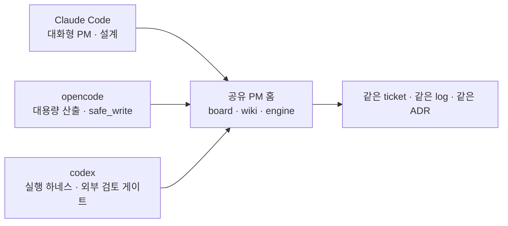

에이전트는 바뀌어도 프로젝트의 기억은 바뀌지 않는다. 한 하네스의 세션이나 출력 한계가 곧
프로젝트의 한계가 되지 않고, 역할과 상황에 맞는 하네스를 선택하면서 같은 일을 이어갈 수 있다.

여기까지가 발표의 본편이다. 아래는 실제 도입과 운영 중 세부 동작을 확인할 때 펼쳐 보는
레퍼런스다.

---

## 운영 레퍼런스

일상 사용자는 이 절의 명령을 외울 필요가 없다. 초기 도입과 엔진 갱신은 관리자 또는 PM 에게
맡기고, 평소에는 `/pm-bootstrap`, 자연어 요청, `/pm-handoff` 흐름만 사용하면 된다.

### 도입과 엔진 관리

새 프로젝트에는 Claude Code, opencode, codex 중 하나만 넣거나 여러 하네스를 함께 넣을 수 있다.
프레임워크 checkout 루트(`<manager>`)에서 실행한다:

```bash
<manager>/pm-import.sh --new <project> --harness claude
<manager>/pm-import.sh --new <project> --harness opencode
<manager>/pm-import.sh --new <project> --harness codex
<manager>/pm-import.sh --new <project> --harness claude,codex
<manager>/pm-import.sh --new <project> --harness all
```

콤마 선택은 순서·중복과 무관한 집합이며, `all`은 현재 등록된 하네스 전체에서 자동 파생된다.

에이전트에게 채택 자체를 맡기려면 [`ADOPT.md`](ADOPT.md), 손으로 밟으려면
[`docs/manual-import.md`](docs/manual-import.md)를 사용한다. 기존 프로젝트에는 `--into`로 넣는다.

이미 도입된 프로젝트에 다른 하네스를 붙일 때는 변경 계획을 먼저 확인한다:

```bash
./pm-config.sh add-harness opencode --dry-run
./pm-config.sh add-harness opencode
./pm-config.sh add-harness codex --dry-run
./pm-config.sh add-harness codex
```

엔진 갱신은 채택자 루트에서 받는다. **마지막 실행은 변경 0(zero-change)이어야 한다** — 첫 실행은
채택자가 지금 갖고 있는 구세대 updater 가 돌기 때문에, 새 엔진이 추가한 안내(설정 표기 교체·기본값
변경 통지)와 완료 게이트는 그 실행에서 나오지 않는다. 배달된 새 엔진으로 한 번 더 돌려 "최신 —
변경 없음" 을 받은 실행이 그 안내를 낸다:

```bash
./pm-update.sh --dry-run
./pm-update.sh          # RUN1 — 구 updater 가 새 엔진을 배달한다
./pm-update.sh          # RUN2 — 새 엔진이 돌며 안내·완료 게이트를 낸다(변경 0)
```

`pm-update` 는 manifest 에 등록된 엔진 파일과 host 하네스 어댑터만 갱신한다. 프로젝트의 board,
wiki, ticket, log 같은 인스턴스 상태는 덮어쓰지 않는다. 나중에 `add-harness` 로 붙인 guest 하네스
어댑터도 인스턴스 `engine.manifest` 의 전용 구획(마커로 감싼 목록)에 등재돼 관리를 받는다 —
opencode 를 codex 프로젝트에 붙일 때 opencode 가 소비하는 `.claude/skills` 처럼 어댑터
네임스페이스 밖 의존물도 그 구획에 함께 등재된다. `pm-update` 는 이 구획을 보존(코어를 덮어쓴 뒤
재부착)하며, 구획 안 두 종류를 **같은 update 채널**로 전파하되 방식이 갈린다: `@render` 행
(어댑터 렌더물)은 채택자 `local.conf` 값으로 **다시 렌더**하고, 비-`@render` 엔진 행(`@source=`
매핑·guest 하네스의 드라이버/훅 등)은 byte-copy 로 갱신한다. 렌더물이므로 guest 어댑터 카드의
손편집(예 agent 카드의 `model`)은 다음 `pm-update` 가 `local.conf` 값으로 되돌린다 — 값을 바꾸는
자리는 카드가 아니라 `local.conf` 의 `delegate.<role>[.<tier>].{model,reasoning}` 이다.
`add-harness <harness>` 재실행은 그 하네스의 어댑터 파일이 새로 추가/폐기됐을 때(구획 등재 갱신)
쓰고, 값 반영에는 필요하지 않다. 구세대 구획(엔진 행 미등재)은 다음 `pm-update` 가 flavor 배타
경로 증거로 엔진 행을 파생·등재해 동결 없이 수렴한다.

엔진 버전 관리는 별도 `engine.version` 파일이 아니라 git 으로 한다. 릴리즈는 git tag 와
CHANGELOG 로 식별하고, 채택자는 `local.conf` 의 `upstream.rev` baseline 으로 "어디까지 받았는지"를
추적한다. 그래서 갱신 전에는 `pm-update --dry-run` 으로 받을 변경을 보고, 갱신 후에는 test/lint 로
현재 프로젝트에서 실제 동작을 확인한다.

#### frozen 다중 하네스 진단과 마이그레이션

예전 고정 `both` 채택본에서 한쪽 어댑터가 manifest 선언 밖에 남으면 그 트리는 `pm-update` 갱신을 받지
못한 채 오래된 상태로 동결될 수 있다. 채택자 루트에서 `./pm-update.sh --dry-run`
(`pm_update --dry-run`)을 실행해 `미등재 flavor 파일 관측` 경고와 관측 형상을 확인한다. legacy
manifest는 core 경로 집합이 정확히 한 현행 flavor와 완전 일치할 때만 자동 승격한다. 그 밖의
형상은 flavor 승격·행 제거·치유 없이 로컬 manifest 그대로 갱신하며, 사용자 stray/커스텀 행이면
경고를 무시할 수 있다.

`pm-update`는 정확히 어느 flavor의 옛 manifest인지 판별되는 경우 그 flavor만 자기치유한다. 고정
쌍의 누락된 flavor는 사용자 stray 파일과 구별할 수 없어 자동 승격하지 않는다. `add-harness`도 그
하네스 어댑터만 등재하므로 완전 마이그레이션이 아니다. frozen Claude+opencode 채택본을 완전히
전환하려면 아래 순서를 그대로 실행한다. `--into`는 충돌 파일을 `.pm_import_backups/`에 백업하고
현재 두 flavor의 manifest 합집합을 설치한다.

```bash
<manager>/pm-import.sh --into <project> --harness claude,opencode --dry-run
<manager>/pm-import.sh --into <project> --harness claude,opencode
cd <project> && ./pm-update.sh
```

재-import는 커스터마이즈된 `CLAUDE.md`/`AGENTS.md`를 템플릿 판으로 덮을 수 있다. 원본은
`.pm_import_backups/<날짜>/`에 백업되므로, 진입 문서 커스텀은 그 백업에서 재병합한다.

이 절차 뒤 manifest에는 두 flavor의 `@source` provenance가 들어가므로, 이후 `pm-update`는
`@render`뿐 아니라 `lib`/`plugins`를 포함한 두 flavor 전체를 갱신한다.

**위임 설정** `delegate.<role>[.<tier>].{harness,model,reasoning}`은 native와 cross 위임이 함께
읽는 라우팅 단일 진실이다. target harness가 현재 PM 하네스와 같으면 각 하네스의 native agent
transport를 쓰고, 다르면 `pm_delegate.py` cross transport를 쓴다. `delegate.enabled`는 위임
전체의 마스터 스위치이고 **기본은 허용**이다(채널 무관). 끄려면 `delegate.enabled=false`를
명시하며, 그때 막히는 것은 `pm_delegate` 실행(rc=3)·`ticket prepare`(rc=3)·훅이 깔린 하네스의
역할 spawn(deny)이다 — 훅 등록은 채택자 소유 파일이라 훅을 깔지 않은 형상의 ad-hoc native
spawn까지 막지는 못한다. Claude native agent 카드의 `model:`이 설정과 어긋나거나 카드가 손상되면
가드가 비차단 경고를 내며, 설정이나 카드를 자동으로 고치지 않는다.

역할·티어 카드는 세 하네스가 **같은 규칙**을 쓴다 — claude `.claude/agents/*.md` · codex
`.codex/agents/*.toml` · opencode `.opencode/agents/*.md` 의 모델(과 codex TOML 이 함께 갖는
추론 강도)은 전부 `local.conf` 의 렌더 파생물이고 다른 출처를 갖지 않는다. 난제 티어
`developer-hard` 도 세 하네스가 모두 카드를 갖는다(평시 프로필을 상속하지 않는 별도 세트).

**모델 값에 무엇을 넣는가**는 하네스마다 형식이 다르다(claude=별칭 또는 풀네임 ·
opencode=`provider/model` · codex=사용자 codex config 가 인정하는 문자열). 값 목록을 문서에
박아 두지 않는다 — 모델은 자주 바뀌어 곧 stale 이 된다. 무인자 `pm-config` 콘솔의
`[m] 위임 모델 안내`가 **이 환경에 설치된 하네스만** 대상으로 값 형식과 확인 방법을 보여주고,
조회 수단이 있는 opencode 는 실제 목록을 조회해 보여준다(조회 실패 시 형식 안내로 강등하며 그
사실을 말한다). `delegate.model_alias`를 선언해 뒀다면 그 멤버도 함께 보여준다.

### `local.conf` 키 카탈로그

`local.conf`에는 **이 clone이 실제로 정한 값만** 둔다(`board.py init`이 만드는 파일도 실값 6줄뿐).
키 목록과 기본값은 여기가 단일 진실이며, 설정하지 않으면 아래 기본값으로 동작한다. 표기는 전부
dot notation이고 세그먼트 안 철자는 그 식별자의 정본을 따른다(역할은 `code-reviewer`처럼 하이픈,
속성은 `idle_timeout`처럼 snake_case).

| 키 | 기본값 | 뜻 |
|---|---|---|
| `project.name` | (빈값) | 어댑터 문서 렌더에 쓰는 프로젝트 이름 |
| `project.tagline` · `project.root` · `project.date` | (없음) | 어댑터 문서 렌더 토큰(한 줄 소개·문서가 가리키는 루트 경로·기준 날짜) |
| `runtime.py` | 탐지값 | 이 clone의 python 인터프리터(`board.py init`이 실행검증으로 채운다) |
| `test.cmd` | `pytest -q` | 회귀 게이트가 그대로 실행하는 프로젝트 test 명령 |
| `qa.platforms` · `test.<name>.cmd` | (없음) | opt-in platform 목록과 각 host-side wrapper 명령. 무인자 FULL이 core 뒤 선언 순서로 직렬 실행하며 같은 HEAD 결과 marker를 요구 |
| `identity.user` | `git config user.email` | 이 clone에서 나는 누구인가(slot·task 무관) |
| `upstream.path` | (없음) | `pm-update`가 기본 source로 쓰는 프레임워크 경로/URL |
| `upstream.rev` · `upstream.seen_rev` | (없음) | drift-lint의 baseline과 현재 관찰값(엔진이 기록) |
| `delegate.enabled` | `true` | 위임 마스터 스위치(채널 무관). 끄려면 `false` |
| `delegate.<role>[.hard].{harness,model,reasoning}` | (없음) | 역할→하네스/모델 매핑. 세트를 통째로 쓴다(티어 간 상속 없음) |
| `delegate.<role>[.hard].fallback.{harness,model,reasoning}` | (없음) | **인프라 실패**(스폰 실패·타임아웃·한도/인증) 1회 대체. 정상 완료 판정(반려·must-fix)은 대상이 아니다 |
| `delegate.model_alias.<name>` | (없음) | 모델 별칭 |
| `delegate.timeout` · `delegate.idle_timeout` | 하네스별 엔진 기본 | 위임 실행의 벽시계 백스톱과 무진행 판정(하네스별 키가 이긴다) |
| `delegate.code-reviewer.rounds_max` | `3` | 내부 code-reviewer 라운드 수렴 상한(추가 리뷰어 예산과 별개 축·과금 없음) |
| `harness.<name>.{idle_timeout,wall_timeout}` | 하네스별 엔진 기본 | 외부 하네스 실행의 무진행 판정(주)과 벽시계 백스톱. 미설정이어도 안전하다 |
| `harness.<name>.ctx_window_tokens` | `ctx.window_tokens` | 그 하네스의 컨텍스트 예산(분모) |
| `harness.opencode.pro_model` | (없음) | opencode 어댑터 카드 렌더에 쓰는 모델 |
| `ctx.nudge_pct` · `ctx.stop_pct` | `30` · `20` | 잔여 컨텍스트 % 기준 checkpoint 넛지·정지 임계 |
| `ctx.window_tokens` | `200000` | 하네스별 값이 없을 때의 컨텍스트 예산 |
| `regression.min_collected` | (없음) | 회귀 수집 하한(0 수집 false-green 차단) |
| `additional_reviewer.enabled` | `false` | 추가 리뷰어 opt-in(외부 전송·과금 동의) |
| `additional_reviewer.{harness,model,reasoning}` | (없음) | 리뷰어 대상. 세 키를 세트로 쓴다 |
| `additional_reviewer.{rounds_max,incomplete_rounds_max,wave_budget}` | 엔진 기본 | 라운드/예산 상한(비용 게이트가 아니라 anti-loop 정지) |
| `additional_reviewer.{timeout,idle_timeout,progress_signal}` | 엔진 기본 | 리뷰어 실행 예산(하네스별 키가 이긴다) |
| `additional_reviewer.{paths,denylist_extra,env_keep_extra,home_artifacts_extra}` | (없음) | 리뷰 대상 경로·격리 예외 |

역할 모델을 고를 때는 **generate≠evaluate**가 기준이다. 위임은 매번 새 세션이라 모델이 같아도
전사 공유가 없지만, `delegate.code-reviewer.model`을 developer와 다르게 두면 맹점을 공유하지 않아
검출력이 는다(하네스는 달라도 된다). `.reasoning`은 codex가 `low/medium/high/xhigh`를 받고,
claude·opencode는 실측 후 적용되며 그 전에 지정하면 fail-loud다.

**추가 리뷰어**(additional reviewer) 는 기본적으로 꺼져 있다. 켜면 코드 diff 가 외부로 전송되므로
프로젝트가 직접 opt-in 을 결정한다. 질문은 첫 init/update 에서 **한 번**뿐이고, "예" 는
`local.conf` 에 아래 튜플을 원자적으로 기록한다.

```
additional_reviewer.enabled=true
additional_reviewer.harness=codex
additional_reviewer.model=gpt-5.6-sol
additional_reviewer.reasoning=max
```

`additional_reviewer.enabled=true` 는 설정된 외부 전송과 통상 과금에 대한 지속 동의라, 그 뒤 리뷰마다
비용 승인을 다시 받지 않는다. 프로필은 세 키를 고쳐 교체한다. 리뷰어 대상은 이 구조화 키로만
지정하며, 옛 `reviewer_cmd` 통짜 커맨드는 더 이상 읽히지 않는다.

`local.conf` 키 표기는 **dot notation 하나로 통일**돼 있다(`additional_reviewer.enabled`·
`delegate.timeout`·`ctx.window_tokens`·`harness.opencode.pro_model` 형태). 옛 flat 표기
(`external_review_enabled`·`additional_reviewer_enabled`·`reviewer_cmd`·`ctx_window_tokens_opencode`
등)는 **읽히지 않고 조용히 무시되지도 않는다** — 그 conf 를 소비하는 도구가 실행 시점에 멈추고
구키마다 대응 신키(또는 제거됨)를 한 줄씩 찍는다. 엔진은 인스턴스 소유인 `local.conf` 를 대신
고쳐 쓰지 않으므로 안내대로 키 이름을 바꿔 주면 된다. `pm-update` 의 파일 반영 자체는 이 검사에
막히지 않아서, 구키가 남은 상태에서도 엔진 갱신을 받아 안내를 볼 수 있다.

위 카탈로그와 옛 flat 표기 어느 쪽에도 없는 키(오타·이 문서에서 사라진 폐기 키)는 조용히
무시되지 않는다 — `board.py lint`(그리고 `board.py init` 병합 경로)가 `local-conf-unknown-key`
advisory 1줄로 표면화한다. push 를 막지는 않지만(`lint --gate` 종료코드 비기여) 무인자
`board.py lint` 는 그 줄을 보인다. 값을 자동으로 고치지 않으므로 오탈자면 직접 바로잡는다.

### 티켓의 수명

티켓은 디렉토리 사이를 이동하며 상태가 바뀐다. 디렉토리가 곧 상태라서 별도 DB 없이 `mv` 가
atomic lock 역할을 한다.

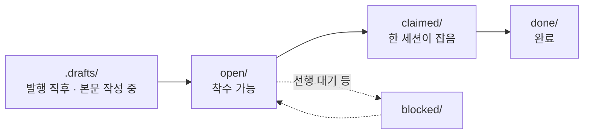

- **발행** — 티켓은 draft 로 시작한다. 목표와 완료 조건이 채워지기 전에는 공유 보드에
  올라가지 않고, 본문을 채워 promote 해야 open 이 된다.
- **claim** — 세션이 티켓을 잡으면 그 세션 명의로 귀속된다. 이미 잡힌 티켓은 다른 세션이
  잡을 수 없다 (병렬 충돌 방지). `depends_on` 으로 선후를 걸어 두면 선행이 끝나기 전에는
  잡지 않는다.
- **완료** — 구현과 검토가 끝나면 done 으로 옮긴다. 테스트 통과가 완료 조건이고, 완료
  시각과 세션이 티켓에 남아 나중에 "언제 누가 무엇을 했나"를 board 에서 되짚을 수 있다.

### Spike 와 ADR

굳혀야 할 설계 결정은 두 단계로 남긴다.

**Spike** 는 설계 과정의 기록이다. 세션이 혼자 결정하지 않고, 실측한 현황과 옵션을 사용자와
한 절씩 합의하며 문서로 다듬는다. 합의가 끝나면 봉인해서(sealed) 불변 기록이 되고, 이후
개정은 새 파일로 쌓인다.

**ADR**(Architecture Decision Record) 은 spike 에서 굳힌 결정의 요약이다. 무엇을 왜 그렇게
정했고 어떤 대안을 기각했는지가 번호로 남는다. 현재 구조의 단일 진실은 architecture.md 가
갖고, ADR 은 "왜 이렇게 만들었나"의 역사를 맡는다. 시간이 지나 맥락을 잃은 세션도 결정의
근거를 문서에서 복원할 수 있다. compaction 으로 잃기 쉬운 것이 바로 이 결정의 맥락이다.

진행은 대화다. 주제를 열면:

```text
멀티 세션 정체성 문제를 설계 spike 로 다뤄줘.
```

세션이 코드와 데이터를 실측해 현황을 보고하고 scope 를 확정한 뒤, 옵션 A/B 를 장단점과
권고와 함께 제시한다. 사람은 한 절씩 결정해 간다:

```text
A안으로 가자. 훅은 권고안대로.
```

모든 절이 합의되면 사인오프로 봉인(sealed)하고, 굳힌 결정을 ADR 과 구현 티켓으로 발행시킨다:

```text
사인오프. ADR 발행하고 구현 티켓으로 쪼개서 진행해줘.
```

### Domain 지식

작업하며 알게 된 도메인 지식은 위키의 domain 페이지로 쌓는다. 페이지는 `covers:` 로 코드
글롭에 연결돼 있어서, 그 코드를 고치면 관련 페이지가 소환되고, 코드가 페이지보다 새로워지면
stale 표시가 붙는다. 배운 것은 `domain capture` 로 페이지에 적는다. 지식이 정적 문서로
죽지 않고 코드를 따라 산다.

```text
이번에 파악한 결제 취소 흐름을 domain 페이지로 채록해줘.
```

### 에이전트 구성

PM 이 메인 세션이고, 일은 네 축의 서브에이전트에 나눠 준다. 만든 주체가 검토하지 않는다는
분리가 핵심이다.

| 에이전트 | 하는 일 | 하지 않는 일 |
|---|---|---|
| PM (메인 세션) | 사용자 지시의 ticket 발행·claim 전 자족성 분할·위임·비준, 보드와 일지 기록. 결정과 종합은 여기서만 한다. | 직접 구현 (위임이 원칙) |
| researcher | 여러 파일과 레퍼런스를 훑어 사실만 수집해 온다 (read-only). | 코드·문서 수정 |
| architect | 구현 경계와 developer 필수 테스트 계약을 확정한다. | 결정·발행 (비준은 PM) |
| developer | 최초 구현과 마지막 fix에서 단계별 테스트를 실행한다. | 보드 조작, 일지 갱신 |
| code-reviewer | 변경을 독립 검토하고 must-fix마다 수정·추가 회귀 계약을 낸다. | 코드 수정 |

모델과 권한은 어댑터 정의에서 정한다. Claude Code 는 `.claude/agents/<역할>.md`,
opencode 는 `.opencode/agents/<역할>.md`, codex 는 `.codex/agents/<역할>.toml` 쪽 정의를 쓴다.
역할별 모델이나 권한을 바꾸고 싶으면 해당 하네스 어댑터만 조정하면 된다.

### 디렉토리 구조

엔진(`.project_manager/`)은 모든 타깃이 공유하고, 어댑터층만 하니스마다 다르다:

```
<프로젝트 루트>/
├── (진입 문서)                 # claude_code: CLAUDE.md · opencode/codex: AGENTS.md
├── .project_manager/           # 공유 엔진 (숨김 — ls -a)
│   ├── tools/                  #   board.py · domain.py · ticket_finish.py · pm_*.py
│   └── wiki/                   # 문서 위키
│       ├── architecture.md     #   현재 아키텍처의 단일 진실
│       ├── status.md           #   활성 모듈 매트릭스
│       ├── domain/             #   살아있는 지식 레이어 (covers 로 코드 추적)
│       ├── decisions/          #   ADR — 결정과 근거
│       ├── pm_role.md · pm_state.md · pm_playbook.md   # PM 운영 매뉴얼과 인계 상태
│       ├── log/                #   작업 일지 — current.md + archive/
│       ├── tickets/            #   open/ claimed/ blocked/ done/ + _template
│       └── specs/ · ideas/ · raw/                       # 사양 · 아이디어 · 스냅샷
└── (어댑터층)                  # claude_code: .claude/ · opencode: .opencode/ · codex: .codex/ + 진입 문서
```

어댑터층은 그 하니스의 에이전트와 skill 정의, 진입 문서다. 세부는
[`templates/claude_code/README.md`](templates/claude_code/README.md),
[`templates/opencode/README.md`](templates/opencode/README.md),
[`templates/codex/README.md`](templates/codex/README.md) 를 본다.

### 문서

| 필요한 것 | 위치 |
|---|---|
| 수동 도입 절차 | [`docs/manual-import.md`](docs/manual-import.md) |
| placeholder 채우기 | [`docs/placeholders.md`](docs/placeholders.md) |
| 이식성 등급 | [`docs/portability.md`](docs/portability.md) |
| multi-repo 운용 | [`docs/multi-repo.md`](docs/multi-repo.md) |
| 에이전트용 채택 가이드 | [`ADOPT.md`](ADOPT.md) |
| 에이전트 진입점 | [`CLAUDE.md`](CLAUDE.md) · `AGENTS.md` |
| PM 운영 매뉴얼 | `.project_manager/wiki/pm_role.md` · `pm_state.md` · `pm_playbook.md` |
| 하니스별 어댑터 세부 | [`templates/claude_code/`](templates/claude_code/README.md) · [`templates/opencode/`](templates/opencode/README.md) · [`templates/codex/`](templates/codex/README.md) |

---

## 크레딧

- Ticket 보드 — 디렉토리가 곧 상태고 `mv` 가 곧 lock 이다. 의도된 단순함.
- 문서 위키 — Andrej Karpathy 의 LLM Wiki 패턴을 계승하되, 정적 지식 베이스가 아니라
  ticket 을 따라 자라는 운영 계층으로 바꿨다.
- 역할 분리 — 만든 주체가 검토하지 않는다(generate ≠ evaluate).
- PM 스킬 — Junu Jeon 의 "How to Ride Your Horse" SDLC skill chain 에서 영감을 받았다.
  자동화 장치가 아니라 각 단계를 명시적으로 밟게 하는 장치다.

실전 멀티-에이전트 프로젝트에서 검증하며 발전시키는 운영 프레임워크다. 팀과 프로젝트마다 필요한
자동화 수준은 다르지만, 되돌리기 어려운 결정(자본, 안전 한도, 외부 송신 같은 것)은 자동화하지
않고 사용자 게이트로 남긴다.

## 라이선스

[MIT](LICENSE)
